## Assembly tutorial	
### Body installation	
"1.  Acrylic plates  A01 and  A06 are installed  with four M3*12 screws and  four M3  nuts (The “www.adeept.com” written on the A01 will be facing down).

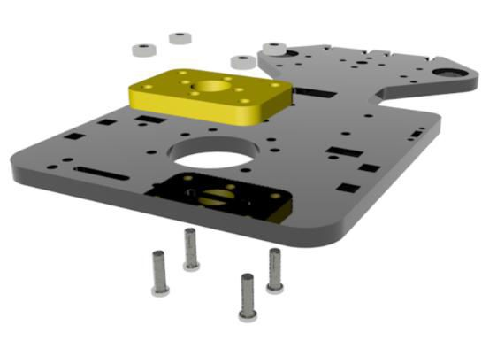
"	

"
	
	
"
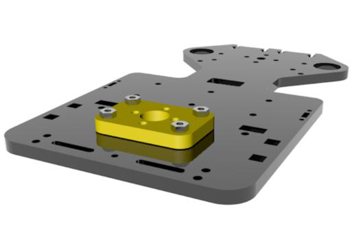

2. Four M2*14 screws, four M2*6 copper pillars, and four M2 nuts are used to install  two WS2812 modules.

The large wire interface in the WS2812 module is used to connect the Robot HAT.  The  ""IN"" interface of the WS2812 module receives an electrical signal, and the ""OUT"" interface outputs the electrical signal to other WS2812 modules. 

"	
"The light source of the WS2812 module faces outward.

"	
"3.  Install the battery box with two M3*10 countersunk screws and two M3 nuts.

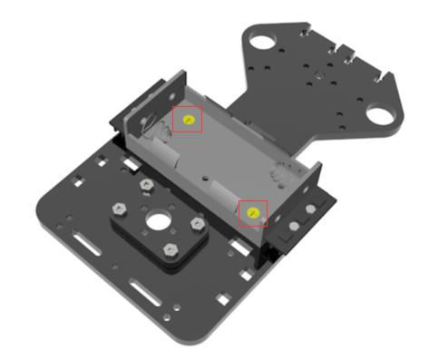
"	
	
"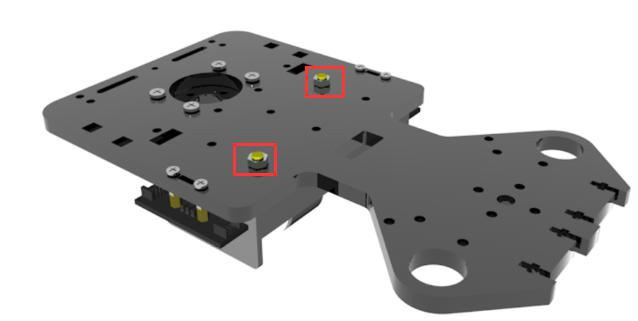
4.  Install A02 with two M3*12 screws and two M3 nuts. (the A02 holes must be placed at the right position).

	
	
"

5.  Install two WS2812 modules with four M2*10 screws and four M2 nuts.

"	
"The light source of the WS2812 module faces inward.

"	
"
6.  Install bevel gear and motor with two M3*8 screws and one M3*3 inner hexagon headless machine-processed rice screw.

"	
"The bevel gear screw hole must be perpendicular to the plane of the motor shaft. 

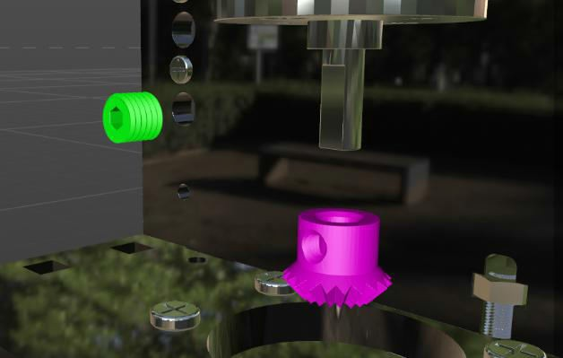
"	
"A little gap need to be set aside to ensure that the motor end does not touch the bevel gear. 

"	
	
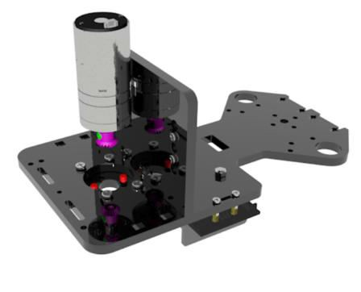

"Install two A10 and one A04 with eight M3*8 screws and four M3*30 copper columns.

"	

	
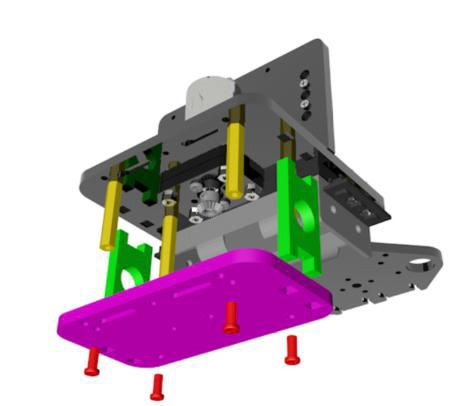

"7. Use four M4x4 headless machine-processed rice screws, one M3x3 headless machine-processed rice screw, two bearings F624ZZ, and two spring washers M4 to install two hexagon couplings S12D4, one bevel gear, and one cylinder.

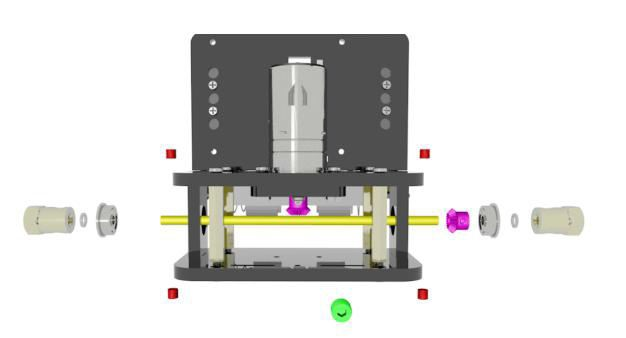
"	
"Fix the hexagon coupling S12D4 with M4*4. 

"	
"Install the right bearing on the acrylic board and fix the center of the cylinder, then adjust the position of the bevel gear and fix it with M3*3 screws.

"	
"Engagement angle after installation. Try to rotate the cylinder to ensure proper engagement.

"	

"Use two M4*6 screws to install the wheels. 

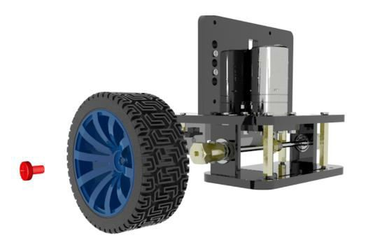

"	
	
"8.  Use two M3*12 screws and two M3 nuts to install the A03 and the tracking module. (the arrow must point forward). 

"	
"The direction of the arrow must be forward.

"	
	
"9. Install the AD002 servo and A09 with four M3*8 screws, two M2*10 screws, two M2 nuts, and two M3*12 copper pillars. (the servo rotation angle needs to be adjusted to the middle position before the servo is installed).

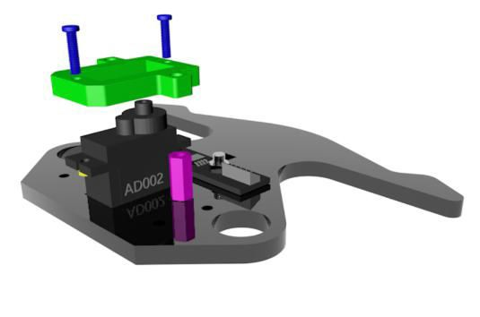
"	
"Use M3*8 screws and copper posts to fix the servo.

"	

"10.  Use four M3*8 and four copper pillars M3*30

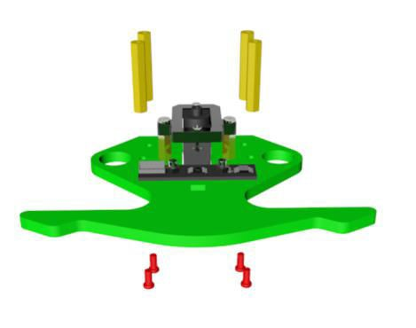

"
	
"11. Use two M4*40 screws and two M4 nuts to install four gaskets, four bearings F624ZZ, two A08, two A11, two nylon isolation Posts M7*4*18 and two wheels. (the A08 must be installed in the right direction).

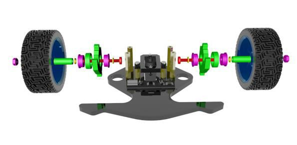

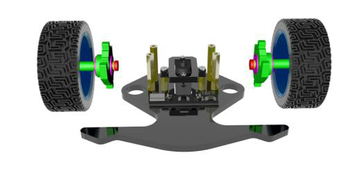
"	
	
"12.  Use one M2.5*4 screw and one self-tapping screw in the servo package to install one A07, one rocker arm and four bearings F687ZZ.

"	
	
"Install the rocker arm and A07 with a self-tapping screw.

"	

"Fix the A07 and install the rocker arm on the servo.

"	

"Use an M2.5*4 to fix the rocker arm.

"	
	
"13.  Use eight M1.6*10 screws and eight M1.6 nuts to fix eight M2 nuts, the camera, ultrasonic and A18.

"	
"Install the M2 nuts.

"	
"First install the camera, then install the ultrasonic.
"	
	
"14.  Use two M2*10 screws to install the servo and A15.
"	
"Use six M3*8 screws and three M3*30 nylon columns to install the A16 and A17.
"	
	
	
	
"15.  Use one M3*18 screw and one M3 screw to install the A14.
"	
	
	
"16.  Use two M2*10 screws and two M2 nuts to install the A12 and AD002 servo.
"	
"When installing the servo, place the servo port correctly.
"	
	
	
"17.  Use a self-tapping screw and M2.5*10 screws in the servo package to install the rocker arm, and use one M3*12 and one M3 nut to install the A13.
"	
"Install the rocker arm and A13 with a self-tapping screw.
"	
"After installation, it is recommended to power on the servo to check whether it is installed in the correct position.
"	
"18.  Use four self-tapping screws M1.7*6*6 and four M3*14 screws to install the aluminum alloy turntable and circular rocker arm.
"	
	
	
"Use one M2.5*10 to install the circular rocker arm, A19, and servo in turn. The circles of A19 and A12 must coincide (M2.5*10 screws need to be tightened).
"	
"The angles of the four screws after installation are shown in the figure.
"	
"Use four M3 nuts to fix the bearing 51105 and acrylic plate.
"	
"Make four M3*14 screws pass through the acrylic plate. Make the camera face forward when installing.
"	
"Use an external hexagon wrench to tighten the nuts until no relative lateral movement of the bearing exists. After tightening, rotate the bearing to ensure that it can rotate. Then power on the servo, adjust the middle position, and observe whether the servo can rotate after power on and whether the camera faces forward.
"	
"19.  Use four M3*8 screws to install the upper and lower parts.
"	
	
	
"20.  Use two M2*14 screws and two M2 nuts to install the two RGB modules and A05.
"	
"First screw on the nuts, then put it into the corresponding slot, and then tighten them.
"	
	
	
"21.  Use four copper pillars M2.5*14, four copper pillars M*10+6, and eight M2.5*10 screws to install the raspberry pi and Motor HAT.
"	
	
"Before installing the raspberry pi on the acrylic board, connect the circuit to the Motor HAT board according to the circuit diagram.
"	
"Install the raspberry pi on the acrylic board after connecting the circuit.
"	
	
Circuit Wiring Diagram	
"The number of three servos
"	
"The RGB LED module number
"	
Connect the components as shown in the figure. The wires must be matched with the ports.	
