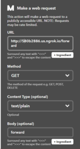
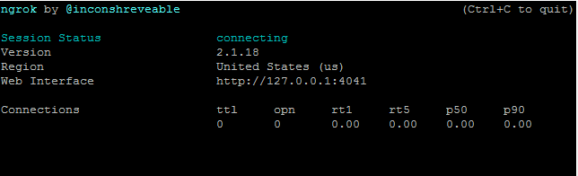
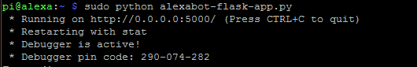

### Alexabot: Amazon Alexa gesteuerter Roboter mit dem Raspberry Pi

Quelle: https://www.dexterindustries.com/projects/alexabot-amazon-alexa-controlled-robot/

HINWEIS: Dieses Tutorial ist veraltet. Bitte beziehen Sie sich auf

Richten Sie das AVS Device SDK auf Raspberry Pi aus der Quelle ein
https://developer.amazon.com/en-US/docs/alexa/avs-device-sdk/raspberry-pi.html

HINWEIS: Dieses Tutorial ist veraltet. Weitere Informationen finden Sie im Alexa Voice Service SDK


*Alexabot ist ein von Amazon Alexa gesteuerter Roboter, der sich bewegt, wenn Sie ihm den Befehl geben.
Dein Wunsch ist mir Befehl.*


In diesem Tutorial bauen wir Alexabot, den Amazon Alexa Controlled Robot, mit dem Raspberry Pi. Wir führen Sie durch die Schritte zum Bau eines sprachgesteuerten Roboters mit Raspberry Pi und GoPiGo. Mit Alexabot können Sie den Raspberry Pi Robot mit Befehlen wie „Alexa Forward!“ herumkommandieren. oder „Alexa-Kaffee!“.

*Endlich ein Raspberry Pi-Roboter, der Ihre Gebote beantwortet, nur mit dem Klang Ihrer Stimme!*

## Übersicht über den von Amazon Alexa gesteuerten Roboter  
Das Demo-Video  
[Video](https://youtu.be/rXP_DZDefeA)
<!--https://www.youtube.com/watch?v=rXP_DZDefeA&feature=emb_logo-->

Das Build-Video  
[Video](https://youtu.be/jiZiNbABGfw)
<!--https://www.youtube.com/watch?v=jiZiNbABGfw&feature=emb_logo-->

Die Amazon Alexa-Software kann auf dem Raspberry Pi Robot, dem GoPiGo, installiert werden. In diesem Projekt wollten wir einen Alexa-basierten Roboter entwickeln, der auf Sprachbefehle reagiert und Ihre Fragen beantwortet. Sie können Alexabot fragen: „Wie heiß ist es in Dubai?“ oder „Wie ist das Wetter in London?“. Was Alexabot wirklich interessant macht, ist, dass Sie es mit Ihrer Stimme steuern können, indem Sie den Alexa Voice Service verwenden.

*Mit Alexabot können Sie den Raspberry Pi-Roboter mit Befehlen wie „Alexa Forward!“ herumkommandieren. oder „Alexa-Kaffee!“.*

Einrichten der Amazon Alexa-gesteuerten Roboterhardware

## Hardware-Setup
Die Hardware zum Aufbau des Alexa-gesteuerten Roboters ist sehr einfach. Wir haben folgende Teile verwendet:

- Der GoPiGo – Der Körper des Roboters. Der GoPiGo wird die Gebote von Alexa ausführen.
- Der Raspberry Pi 3 – Das Gehirn der Operation. Die Verwendung der Pi3-Version des Raspberry Pi-Boards ist aufgrund des schnelleren Chips sehr hilfreich, um den Betrieb zu beschleunigen. AlexaPi ist etwas anspruchsvoll, um höflich zu sein.
- Raspbian for Robots – Die meiste Software für dieses Projekt ist vorinstalliert.
- Der Lautsprecher für den Raspberry Pi – Alexabot wird mit uns sprechen, also brauchen wir einen Lautsprecher, um ihre Stimme zu hören.
- Ein USB-Mikrofon – Unsere Art, mit Alexabot zu sprechen. Dieser ist Plug-and-Play und scheint in einem lauten Raum gut zu funktionieren.

Die Einrichtung ist schnell und einfach. Der erste Schritt besteht darin, den GoPiGo-Roboter für den Raspberry Pi zusammenzubauen. Dann haben wir das Mikrofon an einen der USB-Ports vor dem GoPiGo montiert. Schließlich haben wir den Lautsprecher für den Raspberry Pi oben auf dem GoPiGo montiert und mit einem Kabelbinder befestigt. Der Roboter wird mit 8XAA-Batterien betrieben.

## Software einrichten
Alexabot funktioniert durch die Verwendung einiger aneinandergereihter Dienste.

- AlexaPi: Zuerst verwenden wir Alexa Voice Services, um mit der AlexaPi-Projektsoftware auf Befehle zu hören.
- IFTT: Dies übergibt die Daten an If This Then That.
- ngrok: Wir verbinden uns mit dem ngrok-Dienst zurück zum Pi.
- Flask: Schließlich hören wir auf Befehle und steuern den Roboter mit einem Python-Programm mit einem sehr einfachen Flask-Server.


## Amazon Alexa-gesteuerter Roboter-Schema


- Einrichten von AlexaPi

Der erste Schritt zur Vorherrschaft der Roboterwelt und zum Bau unseres Amazon Alexa-gesteuerten Roboters besteht darin, AlexaPi einzurichten.


Es gibt einige Tutorials, wie Sie Ihren Raspberry Pi mit Amazon Alexa in ein Amazon Echo verwandeln. AlexaPi ist jedoch der einfachste Weg, um Amazon Alexa auf Ihrem Raspberry Pi zu erhalten. Das Projekt hat alles vorbereitet, was Sie tun können, um die Einrichtung von Alexa Voice Services auf Ihrem Raspberry Pi zu vereinfachen und zu vereinfachen. Der schwierigste Teil besteht darin, Ihr Amazon-Entwicklerkonto einzurichten und Ihre Anmeldeinformationen zu sammeln (und das ist wirklich nicht so schlimm!).

Bevor Sie beginnen, möchten Sie Ihren GoPiGo mit Ihrem lokalen WLAN-Netzwerk verbinden und eine statische IP-Adresse dafür einrichten. Der Raspberry Pi benötigt eine statische IP-Adresse, um die Sicherheitsanmeldeinformationen für Amazon einzurichten. Hier ist eine kurze Erinnerung daran, wie Sie eine statische IP-Adresse von Ihrem PC oder eine statische IP-Adresse mit Ihrem Mac einrichten.

Wir sind hier der Schritt-für-Schritt-Anleitung zum Einrichten eines Kontos auf Ihrem Raspberry Pi gefolgt. Zuerst müssen Sie sich für ein Amazon-Entwicklerkonto registrieren. Das Einrichten eines Entwicklerkontos ist kostenlos und einfach. Sie müssen ein Geräte- und Sicherheitsprofil erstellen.

Die Installation von AlexaPi auf Ihrem Raspberry Pi geht auch schnell! Sie müssen hier einige Git-Befehle eingeben. Bevor Sie beginnen, stellen Sie die von Ihnen erstellten Anmeldeinformationen zusammen, z. B. Ihre Client-ID, Ihr Client-Geheimnis und Ihre Sicherheitsprofil-ID. In der Befehlszeile:  

	```
    cd /opt
    sudo git clone https://github.com/alexa-pi/AlexaPi.git
    sudo ./AlexaPi/src/scripts/setup.sh
	```

Zu diesem Zeitpunkt sollten Sie Alexa auf Ihrem GoPiGo ausführen können, genau wie auf einem Amazon Echo. Bitten Sie um ein News-Update: "Alexa, was gibt es Neues?"


- Einrichten von IFTTT
If This Then That ist ein Dienst, mit dem wir verschiedene Teile des Webs miteinander verbinden können. In unserem Fall hilft uns IFTTT dabei, Alexa mit dem Raspberry Pi zu koppeln. Wir müssen IFTTT verwenden, da Alexa keine Textzeichenfolgen an den Pi zurückgeben kann. Aber es kann IFTT alarmieren. IFTTT hilft uns, die AlexaPi-Antworten zurück zum Raspberry Pi zu überbrücken. Zuerst müssen Sie hier ein IFTTT-Konto einrichten. Auch dies ist kostenlos.

Als nächstes müssen Sie Ihrem AlexaPi den IFTTT-Dienst hinzufügen. Sie können dies tun, indem Sie zuerst die Alexa-App auf Ihrem Mobiltelefon installieren (sie ist für iPhone und Android verfügbar und kostenlos). Verbinden Sie sich mit Ihrem Telefon im selben Netzwerk wie Ihr Pi mit Ihrem AlexaPi und fügen Sie den IFTTT-Dienst hinzu.

Als nächstes möchten Sie in IFTTT Ihre Applets einrichten. Wir benötigen ein Applet für jeden Befehl, den wir an die GoPiGo senden möchten.

Verbinden Sie zuerst Amazon Alexa mit Ihrem IFTTT-Konto. Dann werden wir Folgendes tun, um ein Applet zu erstellen, das einen einzelnen Befehl verarbeitet:

1. Erstellen Sie ein IFTTT-Applet *für unseren ersten Befehl. Wir erstellen ein* Alexa-Applet.


2. Wählen Sie „Sagen Sie einen bestimmten Satz“.


3. Geben Sie den Befehl an. Sag „Rückwärts“


4. Wählen Sie als Nächstes „Das“.


5. Wir verwenden den Aktionsdienst „Maker“.


6. Klicken Sie auf „Webanfrage stellen“ und geben Sie die Informationen ein.


7. Die URL ist entweder Ihre bereitgestellte ngrok-URL oder Ihre benutzerdefinierte Domäne. Wir werden dies in unserem nächsten Schritt finden, aber vorerst können wir „ngrok.io“ eingeben.



8. Unser Applet führt eine „GET“-Methode aus, der Inhalt ist Text und fügt nichts in den Textkörper ein.

9. Klicken Sie auf „Aktion erstellen“ und dann auf „Fertig stellen“.

Wir müssen dies für alle Bewegungen tun, die Ihr Amazon Alexa-gesteuerter Roboter ausführen soll! In unserem Projekt haben wir sieben gemacht: eine für „Vorwärts“, „Rückwärts“, „Links“, „Stopp“, „Rechts“, „Tanz“ und „Kaffee“.


- Verbinden Sie sich mit ngrok

Wir werden IFTTT einen Server auf dem Pi kontaktieren lassen, aber der schwierige Teil wird darin bestehen, einen Server auf dem Pi einzurichten, der für die Welt außerhalb unseres lokalen WiFi-Netzwerks sichtbar ist.
[ngrok](https://ngrok.com/) ist ein Dienst, mit dem Sie sich über jedes Netzwerk mit Ihrem Raspberry Pi verbinden können. Mit ngrok müssen Sie sich nicht im selben lokalen Netzwerk wie Ihr Pi befinden, um SSH in oder auf einen Webserver zuzugreifen. ngrok wird uns helfen, Informationen von IFTTT zum Pi zurückzuleiten. IFTTT benötigt für die Kontaktaufnahme eine internetbasierte URL, daher verwenden wir ngrok, um unseren Server für die Außenwelt zugänglich zu machen.

Wir haben hier ein vollständiges Tutorial zur Verwendung von ngrok mit dem Raspberry Pi.

Zuerst [hier ein Konto bei ngrok einrichten](https://dashboard.ngrok.com/signup). Sie können mit einem kostenlosen Konto davonkommen, aber es wird viel einfacher sein, Alexabot mit einem kostenpflichtigen Konto einzurichten. Ein kostenpflichtiges Konto ermöglicht es Ihnen, benannte Server einzurichten, anstatt den zufällig zugewiesenen Server von ngrok.

Als nächstes installieren Sie ngrok auf Ihrem Raspberry Pi. Geben Sie auf Ihrem Pi in der Befehlszeile Folgendes ein:

    mkdir ~/ngrok
    cd ~/ngrok
    sudo wget https://bin.equinox.io/c/4VmDzA7iaHb/ngrok-stable-linux-arm.zip
    entpacken Sie ngrok-stable-linux-arm.zip
Dies sollte die gesamte Software installieren. Als nächstes müssen Sie Ihr Token erhalten. Dadurch wird Ihr Raspberry Pi für ngrok autorisiert. Wenn Sie sich hier bei Ihrem Konto anmelden, sehen Sie Schritt 2, in dem Ihr Token bereits ausgefüllt ist. Es sollte mit „./ngrok authtoken“ beginnen. Kopieren Sie den Befehl und fügen Sie ihn in Ihre Befehlszeile ein.

[ngrok-install-authtoken](imagesGoPiGo/ngrok-install-authtoken-300x200.jpg "ngrok-install-authtoken")
Testen Sie ngrok. Sie können Folgendes in die Befehlszeile eingeben:

    ./ngrok http 80
Und Sie sollten einen Serverstart sehen.



Wenn eine IP-Adresse angezeigt wird, versuchen Sie, diese in Ihren Browser einzugeben. Sie sollten Ihren Standardserver auf Port 80 sehen. Bei Raspbian for Robots sollte die Einstiegsseite von Raspbian for Robots angezeigt werden.

Wir starten unseren Server mit dem folgenden Befehl:

    ./ngrok http -subdomain=dexterindustries 5000
Wobei „dexterindustries“ eine reservierte Domain ist, die mit unserem Basiskonto auf ngrok eingerichtet wurde. Wenn Sie sich für das kostenlose Konto entscheiden, müssen Sie jetzt zurückgehen und den Domänennamen, den ngrok Ihrem Pi oben gegeben hat, erneut in jeden Ihrer IFTTT-Befehle eingeben.


- Einrichten des Flask-Servers
Der letzte Schritt bei der Einrichtung unseres von Amazon Alexa gesteuerten Roboters ist die Einrichtung des Flask-Servers auf dem Raspberry Pi.

Wir richten einen Flask-Server in Python ein, um IFTT zu hören. Wir gehen davon aus, dass Sie Raspbian for Robots ausführen, auf dem der Python-Paketmanager Pip bereits installiert ist. Um Flask auf dem Raspberry Pi zu installieren, müssen Sie einfach Folgendes in Ihre Befehlszeile eingeben:

    sudo pip install kolben

Das wars so ziemlich. Flasche sollte installiert werden. Sie können versuchen, den Flaschenserver auszuführen, den wir in unserem Github-Code bereitgestellt haben, und sehen, was passiert.

Sie können die Datei finden, indem Sie entweder Ihr GoPiGo-Verzeichnis aktualisieren oder einfach ausführen:

    sudo wget https://raw.githubusercontent.com/DexterInd/GoPiGo/master/Projects/Alexabot/alexabot-flask-
    app.py

Und dann den Server ausführen:

    python alexabot-flask-app.py
Sie sollten so etwas sehen:


    

Um eine allgemeine Vorstellung davon zu bekommen, wie der Code auf dem Flask-Server funktioniert, haben wir jeden Befehl so eingerichtet, dass er auf eine bestimmte Flask-URL hört. Wenn Sie beispielsweise in Ihrem Webbrowser „[http://alexabot.ngrok.io/forward](http://alexabot.ngrok.io/forward „http://alexabot.ngrok.io /forward")“ erhalten wir in unserem Browser die Antwort zurück „Alexabot ist vorgerückt!“. Betrachten Sie den Code für das Verzeichnis „vorwärts“:

    print("Vorwärts!")
    gopigo.fwd() # Sende die GoPiGo-Weiterleitung
    time.sleep(1) # für 1 Sekunde.
    gopigo.stop() # das Stoppen des GoPiGo
    return 'Alexabot vorgerückt!'

Das erste, was wir tun werden, ist, etwas Text an die Befehlszeile zu senden. Dann senden wir die GoPiGo vorwärts (einfach mit einer einzigen Codezeile!), warten dann 1 Sekunde und stoppen dann die GoPiGo.

Dies veranschaulicht, wie der Befehl „Vorwärts“ funktioniert; jeder Befehl funktioniert auch auf diese Weise mit seinem eigenen Verzeichnis und benutzerdefiniertem Code zum Verschieben der GoPiGo.


## Ausführen des von Amazon Alexa gesteuerten Roboters
Nachdem alle Dienste eingerichtet sind, sollten wir in der Lage sein, einen Befehl wie „Alexa trigger forward“ zu sagen. Alexa benachrichtigt IFTT, die eine HTTP-Nachricht über ngrok zurück an unsere GoPiGo sendet und an den Webserver sendet, der in Flask läuft . Das Flask-Programm befiehlt dem GoPiGo, sich vorwärts zu bewegen.

Der Schnellstart, um mit Alexabot loszulegen, besteht darin, zuerst AlexaPi zu starten:

    sudo python /opt/AlexaPi/src/main.py

Als nächstes starten Sie ngrok in einem separaten Fenster:

    sudo ~/ngrok/ngrok http -subdomain=dexterindustries -log=stdout 5000 > log.txt &

Starten Sie abschließend den Flask-Server:

    sudo python alexabot-flask-app.py

Fange an zu reden! Denken Sie daran, dass Ihre Befehle mit „Alexa trigger . . . “ und dann den Befehl, den der Roboter ausführen soll.

## Unseren Amazon Alexa-gesteuerten Roboter vorwärts bewegen
Ein Verbesserungsbereich unseres Amazon Alexa Controlled Robot könnte darin bestehen, Verzögerungen zu reduzieren. Mit einer stabilen Internetverbindung ließ ich Alexabot das ganze Wochenende laufen und es war morgens immer noch ansprechbar (Update: 5 Tage und Zählen). Sie werden jedoch feststellen, dass zwischen Befehlen und Antwort eine unterschiedliche Verzögerung besteht. Es gibt so viele Dienste aneinandergereiht, dass eine Verlangsamung wahrscheinlich ist. Der nächste Schritt und zukünftige Verbesserung wäre die Entwicklung eines eigenen Dienstes auf Alexa, um den Textbefehl direkt zurückzugeben.

Sie möchten es selbst bauen? [Sie können GoPiGo und Raspberry Pi hier erhalten](https://www.dexterindustries.com/store/ "Sie können GoPiGo und Raspberry Pi hier erhalten")! Wir würden uns freuen, wenn Sie Ihren eigenen Amazon Alexa-gesteuerten Roboter bauen!