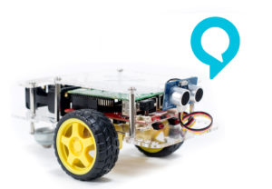
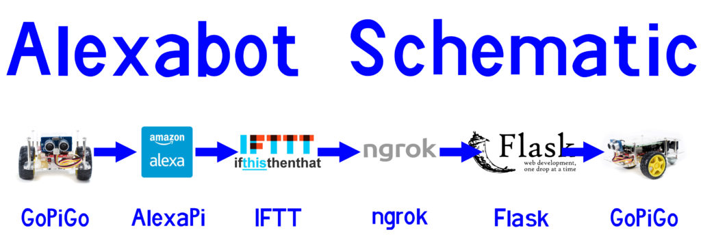
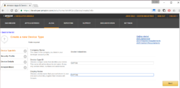
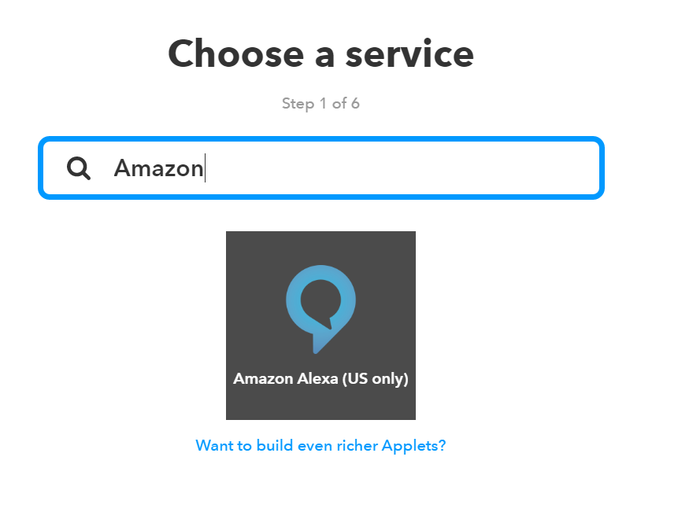
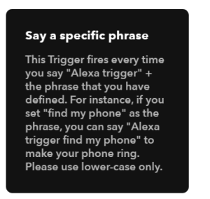
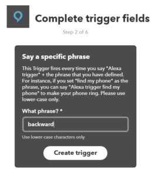
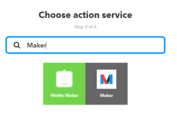
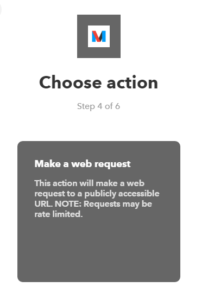
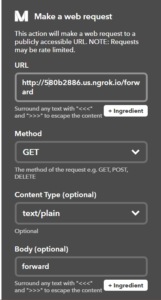
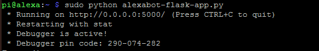

### Alexabot: Amazon Alexa Controlled Robot with the Raspberry Pi

Source: https://www.dexterindustries.com/projects/alexabot-amazon-alexa-controlled-robot/

NOTE: This tutorial is outdated. Please refer to: [Alexa Voice Service  SDK](https://developer.amazon.com/en-US/docs/alexa/avs-device-sdk/raspberry-pi.html "Alexa Voice Service  SDK")

Set Up the AVS Device SDK on Raspberry Pi from Source
https://developer.amazon.com/en-US/docs/alexa/avs-device-sdk/raspberry-pi.html

NOTE: This tutorial is outdated. Please refer to Alexa Voice Service  SDK 

*Alexabot is an amazon alexa controlled robot that moves when you command it.
Your wish is my command.*

In this tutorial we build Alexabot, the Amazon Alexa Controlled Robot, using the Raspberry Pi.  We will walk you through the steps of building a voice controlled robot with the Raspberry Pi and GoPiGo.  With Alexabot, you can command the Raspberry Pi Robot around with commands like “Alexa Forward!” or “Alexa Coffee!”.

*Finally, a Raspberry Pi Robot to answer your bidding, with only the sound of your voice!*

## Overview of the Amazon Alexa Controlled Robot
The Demostration Video
[Video](https://youtu.be/rXP_DZDefeA)  
https://www.youtube.com/watch?v=rXP_DZDefeA&feature=emb_logo

The Build Video
[Video](https://youtu.be/jiZiNbABGfw)  
https://www.youtube.com/watch?v=jiZiNbABGfw&feature=emb_logo

Amazon Alexa software can be put on the Raspberry Pi Robot, the GoPiGo.  In this project, we wanted to create an Alexa-based robot that would respond to voice commands, as well as answer your questions.  You can ask Alexabot “How hot is it in Dubai?”  or “What’s the weather like in London?”.  What makes Alexabot really interesting is that you can command it around with your voice, using the Alexa Voice Service.

*With Alexabot you can command the Raspberry Pi robot around with commands like “Alexa Forward!” or “Alexa Coffee!”.*

Amazon Alexa Controlled Robot Hardware Setup

##Hardware Set Up
The hardware set up to build the Alexa controlled robot is very simple.  We used the following parts:

- The GoPiGo – The body of the robot.  The GoPiGo is going to do Alexa’s bidding.
- The Raspberry Pi 3 – The brains of the operation. Using the Pi3 version of the Raspberry Pi board is very helpful in speeding up the operation due to its faster chip. AlexaPi is somewhat demanding, to be polite.
- Raspbian for Robots – Most of the software for this project is pre-installed.
- The Speaker for the Raspberry Pi – Alexabot will talk back to us, so we’ll need a speaker to hear her voice.
- A USB Microphone – Our way to talk to Alexabot.  This one is plug and play and seems to work well in a noisy room.

Set up is quick and easy.  First step is to assemble the GoPiGo Robot for the Raspberry Pi.  Then we mounted the microphone to one of the USB ports in front of the GoPiGo.  Finally we mounted the speaker for the Raspberry Pi to the top of the GoPiGo and held it in place with a ziptie.  The robot is powered with 8XAA batteries.

## Software Set Up
Alexabot works by using a few services strung together.

- AlexaPi: First, we use Alexa Voice Services to listen for commands, using the AlexaPi project software.
- IFTT: This passes the data to If This Then That.
- ngrok: We connect back to the Pi using the ngrok service.
- Flask: Finally, we listen for commands, and control the robot using a python program using a very simple Flask server.

##  Amazon Alexa Controlled Robot Schematic 

- Setting Up AlexaPi

The first step towards robot world domination and build our Amazon Alexa controlled robot is to set up AlexaPi.

There are a few tutorials on how to turn your Raspberry Pi into an Amazon Echo using Amazon Alexa.  However, AlexaPi is the easiest way to get Amazon Alexa on your Raspberry Pi.  The project has prepared everything you can possibly do to make setting up Alexa Voice Services on your Raspberry Pi streamlined and easy.  The hardest part is setting up your Amazon Developer account and gathering your credentials (and really, that’s not that bad!).

Before you begin, you will want to connect your GoPiGo to your local wifi network, and establish a static IP address for it.  The Raspberry Pi will need a static IP address to set up the security credentials for Amazon.  Here’s a quick reminder of how to set a static IP address from your PC or how to set a static IP address with your Mac.

We followed the step-by-step instructions for setting up an account on your Raspberry Pi here.  First, you’ll need to Register for an Amazon developer account.  Setting up a developer account is free, and easy.  You need to create a device and security profile.

Installing AlexaPi on your Raspberry Pi is also quick!  You’ll need to punch in a few Git commands outline here.  Before you begin, gather up the credentials you created, such as your Client ID, your Client Secret, and your Security Profile ID.  In the command line:

    cd /opt
    sudo git clone https://github.com/alexa-pi/AlexaPi.git
    sudo ./AlexaPi/src/scripts/setup.sh

At this point you should be able to run Alexa on your GoPiGo, just as you would an Amazon Echo. Ask it for a news update: “Alexa What’s the News?”

- Setting Up IFTTT
If This Then That is a service that lets us connect different parts of the web together.  In our case, IFTTT helps us couple together Alexa with the Raspberry Pi. We need to use IFTTT because Alexa can’t return text strings to the Pi.  But it can alert IFTT.  IFTTT helps us bridge the AlexaPi responses back to the Raspberry Pi.  First, you’ll need to set up an IFTTT account here.  Again, this is free.

Next, you’ll need to add the IFTTT service to your AlexaPi.  You can do this by first installing the Alexa App on your mobile phone (it’s available for the iPhone and Android, and it’s free).  With your phone on the same network as your Pi, connect to your AlexaPi and add the IFTTT service.

Next in IFTTT, you will want to set up your applets.  We will need an applet for each command we want to send to the GoPiGo.

First, connect Amazon Alexa to your IFTTT Account.   Then we’ll do the following to create an applet that will handle a single command:

1. Create an IFTTT applet *for our first command.  We will create an* Alexa applet.

2.  Select “Say a Specific Phrase”.

3.  Specify the command. Say “Backward”

4.  Next, select “That”.

5.  We’ll use the action service “Maker”.

6.  Click “Make a web request” and specify the information.

7.  The URL is either your provided ngrok url, or your custom domain.  We will find this in our next step, but for now we can enter in “ngrok.io”.

8.  Our applet will be doing a “GET” method, the content will be text, and don’t put anything in the body.

9.  Click “Create Action” and then “Finish”.

We will need to do this for all the moves you want your Amazon Alexa controlled robot to make!  In our project we made seven: one for “Forward”, “Backward”, “Left”, “Stop”, “Right”, “Dance” and “Coffee”.

- Connect to ngrok

We will have IFTTT contact a server on the Pi, but the tricky part will be setting up a server on the Pi that’s visible to the world outside our local WiFi network. 
[ngrok](https://ngrok.com/) is a service that allows you to connect to your Raspberry Pi through any network.  With ngrok, you don’t need to be on the same local network as your Pi to SSH in or to access a web server.  ngrok will help us pipe information back from IFTTT to the Pi. IFTTT needs an internet-based URL to contact, so we’ll use ngrok to make our server accessible to the outside world.

We have a full tutorial on how to use ngrok with the Raspberry Pi here.

First, [set up an account with ngrok here](https://dashboard.ngrok.com/signup).  You can get away with a free account, but it will be much easier to set up Alexabot with a paid account.  A paid account will allow you to set up named servers, rather than ngrok’s randomly assigned server.

Next install ngrok on your Raspberry Pi.  On your Pi, in the command line, type:

    mkdir ~/ngrok
    cd ~/ngrok
    sudo wget https://bin.equinox.io/c/4VmDzA7iaHb/ngrok-stable-linux-arm.zip
    unzip ngrok-stable-linux-arm.zip
This should install all the software.  You will next need to get your token; this will authorize your Raspberry Pi to ngrok.  If you login to your account here, you will see step 2, with your token already populated.  It should start with “./ngrok authtoken”.  Copy the command, and paste it into your command line.

[ngrok-install-authtoken](imagesGoPiGo/ngrok-install-authtoken-300x200.jpg "ngrok-install-authtoken")
Test out ngrok.  You can type the following into the command line:

    ./ngrok http 80
And you should see a server start up.

When an IP address appears, try typing this into your browser.  You should see your default server on Port 80 come up.  With Raspbian for Robots, you should see the Raspbian for Robots entrance page show up.

We will start our server with the following command:

    ./ngrok http -subdomain=dexterindustries 5000
Where “dexterindustries” is a reserved domain set up with our basic account on ngrok.  If you go with the free account, you’ll now need to go back and re-enter the domain name that ngrok gave your Pi above into each of your IFTTT commands.

- Set Up the Flask Server
The final step in setting up our Amazon Alexa controlled robot is setting up the Flask server on the Raspberry Pi.

We’ll set up a Flask server in Python to listen to IFTT.  We assume you’re running Raspbian for Robots, which has the Python package manager Pip already installed.  To install Flask on the Raspberry Pi, you’ll simply need to bang the following into your command line:

    sudo pip install flask

That’s pretty much it.  Flask should be installed.  You can try running the flask server we’ve provided in our github code and see what happens.

You can find the file by either updating your GoPiGo directory, or by simply running:

    sudo wget https://raw.githubusercontent.com/DexterInd/GoPiGo/master/Projects/Alexabot/alexabot-flask-
    app.py

And then run the server:

    python alexabot-flask-app.py
You should see something like this:

    

To get a general idea of how the code works on the Flask server, we’ve set up each command to listen to a specific Flask URL.  For example, if you were to call, in your web browser, “[http://alexabot.ngrok.io/forward](http://alexabot.ngrok.io/forward "http://alexabot.ngrok.io/forward")” we get the response in our browser back “Alexabot moved forward!”.  Looking at the code for the directory “forward”:

    print("Forward!")
    gopigo.fwd() # Send the GoPiGo Forward
    time.sleep(1) # for 1 second.
    gopigo.stop() # the stop the GoPiGo
    return 'Alexabot moved forward!'

The first think we’ll do is send some text to the command line.  Then we’ll send the GoPiGo forward (easy with a single line of code!), then wait 1 second, and then stop the GoPiGo.

This illustrates how the “Forward” command works; each command will also work this way with its own directory and custom code for moving the GoPiGo.

## Running the Amazon Alexa Controlled Robot
Now, with all the services set up, we should be able to say a command like “Alexa trigger forward”, Alexa will alert IFTT, which will send an HTTP message through ngrok back to our GoPiGo and post to the web server running in Flask.  The Flask program will command the GoPiGo to move forward.

The quickstart to get running with Alexabot are to first start AlexaPi:

    sudo python /opt/AlexaPi/src/main.py

Next, start ngrok in a separate window:

    sudo ~/ngrok/ngrok http -subdomain=dexterindustries -log=stdout 5000 > log.txt &

Finally, start the Flask server:

    sudo python alexabot-flask-app.py

Start talking!  Remember your commands need to start with “Alexa trigger . . . ” and then the command you want to robot to do.

## Moving Our Amazon Alexa Controlled Robot Forward
One area of improvement in our Amazon Alexa Controlled Robot might be to reduce lag.  With a steady internet connection, I left Alexabot running all weekend and it was still responsive in the morning (update: 5 days and counting).  However, you’ll notice there is a varying amount of lag between commands and response.  There are so many services strung together some slowdown is likely.  The next step and future improvement would be to develop our own service on Alexa to return the text command directly.

Want to build it yourself?  [You can get the GoPiGo and Raspberry Pi here](https://www.dexterindustries.com/store/ "You can get the GoPiGo and Raspberry Pi here")!  We would love to hear if you build your own Amazon Alexa controlled robot!