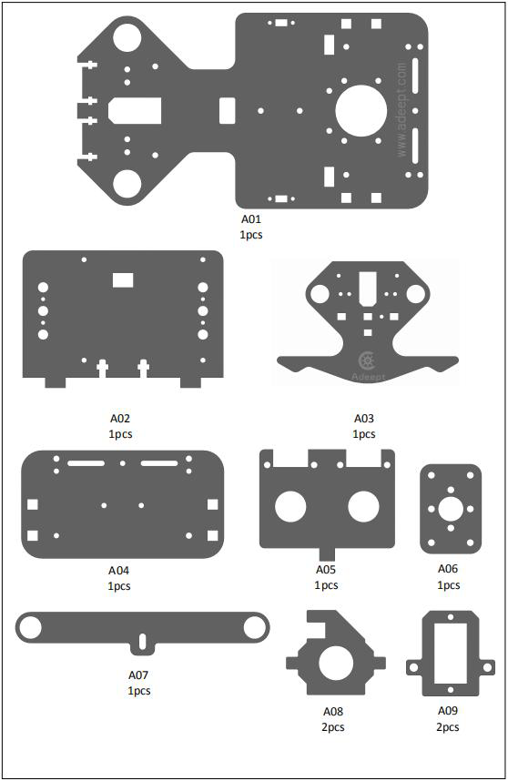
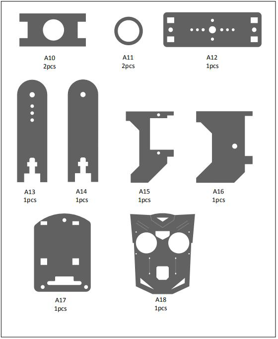
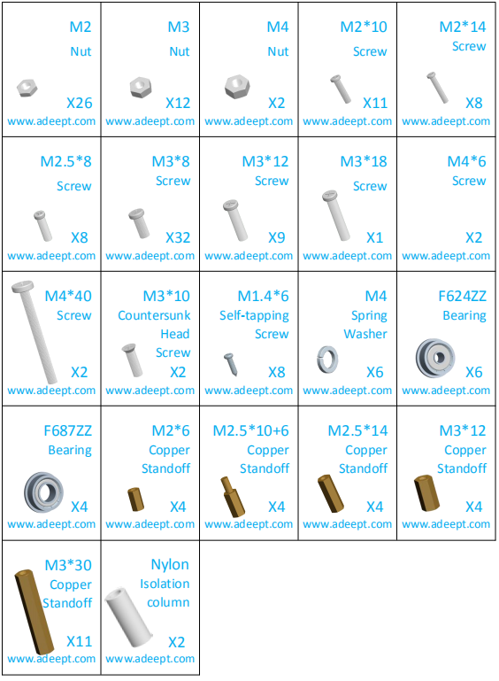
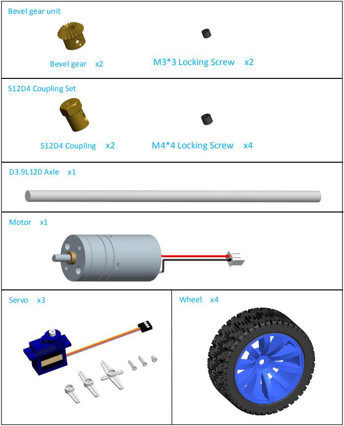
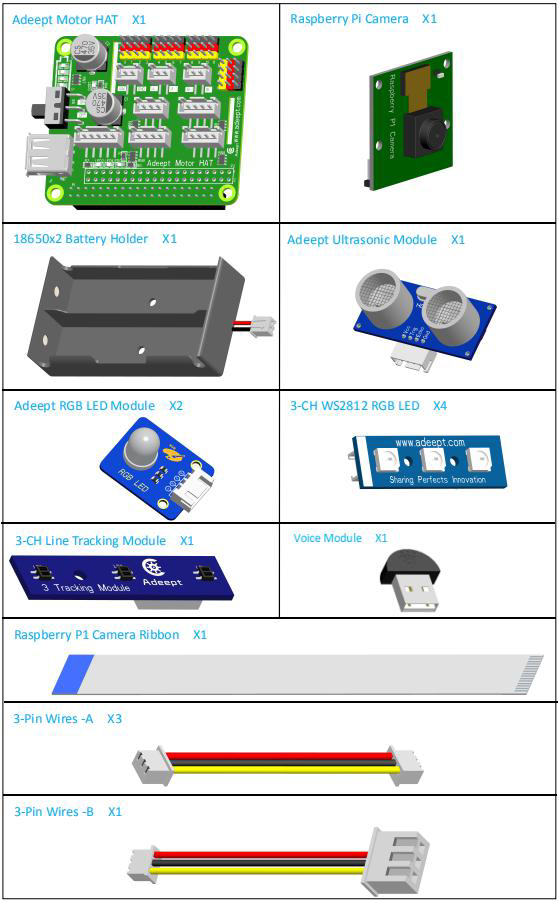
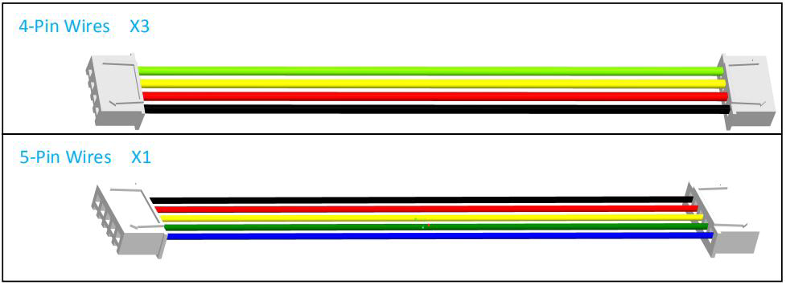
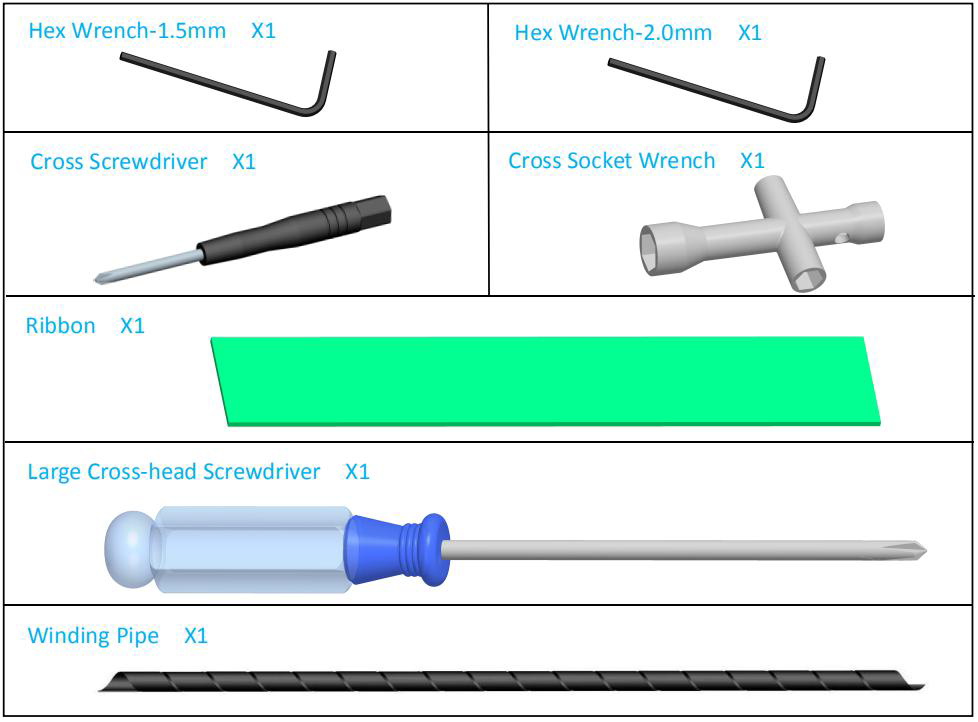
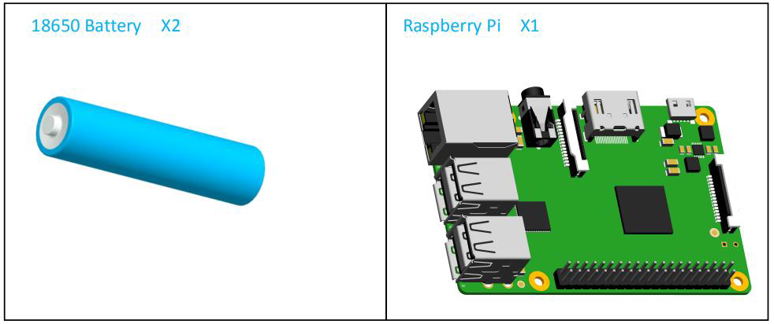

##Ressourcen-Link

[Robotername]: Adeept_PiCar-B

[RobotURL]: https://github.com/adeept/adeept_picar-b

[RobotGit]: https://github.com/adeept/adeept_picar-b.git

[Offizielle Raspberry Pi-Website]: https://www.raspberrypi.org/downloads/

[Image-Datei für den Raspberry Pi Robot]: https://adeept-my.sharepoint.com/personal/tomsun_adeept_onmicrosoft_com/_layouts/15/onedrive.aspx?id=%2Fpersonal%2Ftomsun%5Fadeept%5Fonmicrosoft%5Fcom%2FDocuments%2FadeeptRaspTank&amp ; originalPath = aHR0cHM6Ly9hZGVlcHQtbXkuc2hhcmVwb2ludC5jb20vOmY6L2cvcGVyc29uYWwvdG9tc3VuX2FkZWVwdF9vbm1pY3Jvc29mdF9jb20vRXZCZmhES1dJVEJLb1ZLejFJTThta01CaWc5SHRiZG9sMXdLQU83WTk5cFJWdz9ydGltZT1rUWxJeE9EMjEwZw

[Offizielle Website]: https://www.adeept.com/

[GitHub]: https://github.com/adeept/adeept_picar-b

[Dokumentation zur Strukturmontage]: https://www.adeept.com/learn/detail-33.html

## Komponentenliste

###Acrylplatten

Die Acrylplatten sind zerbrechlich, seien Sie also beim Zusammenbau vorsichtig, falls sie brechen. 
Die Acrylplatte ist mit einer Schutzfolie überzogen. 
Sie müssen es zuerst entfernen. 
Einige Löcher im Acryl können Rückstände aufweisen, daher müssen Sie diese vor der Verwendung reinigen.

### Maschinenteile

Getriebeteile

Elektronische Teile

Werkzeuge

Selbst hergestellte Teile

