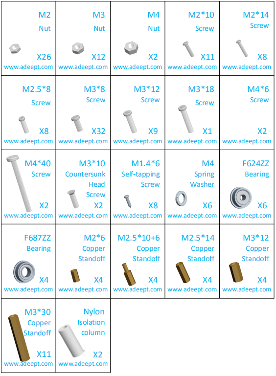
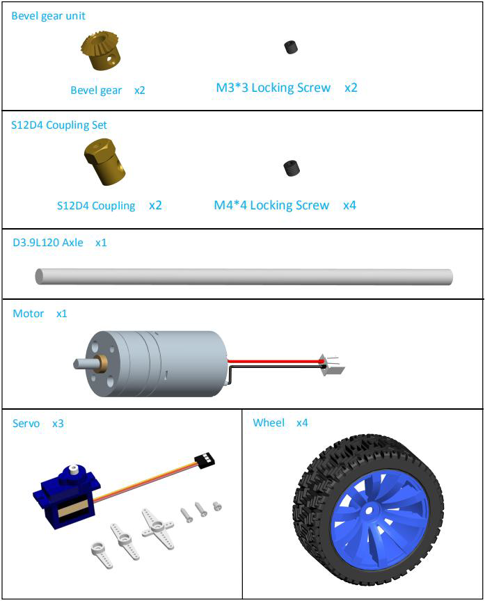
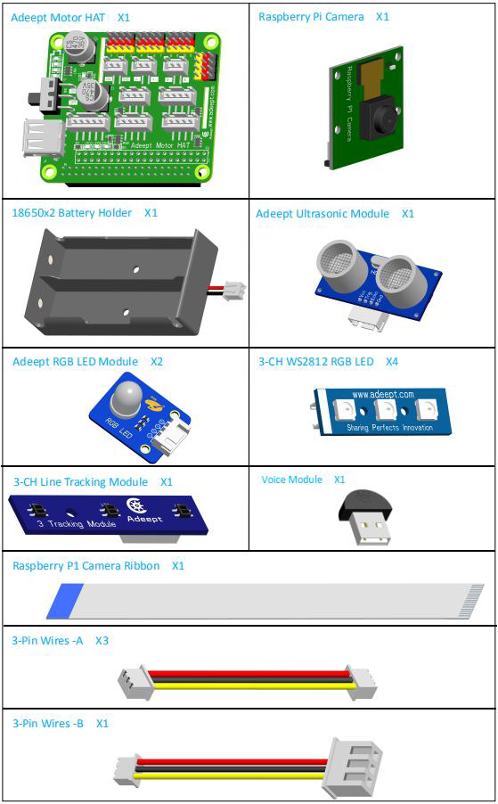
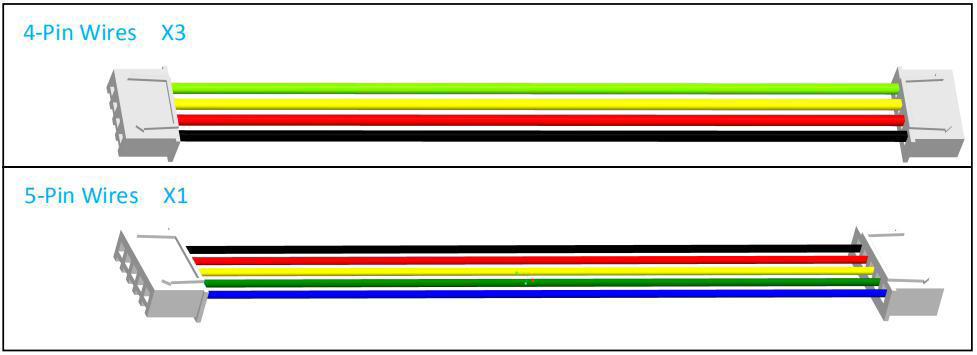

	

## Resources Link														

[RobotName]: Adeept_PiCar-B

[RobotURL]: https://github.com/adeept/adeept_picar-b

[RobotGit]: https://github.com/adeept/adeept_picar-b.git

[Official Raspberry Pi website]: https://www.raspberrypi.org/downloads/

[Image file for the Raspberry Pi Robot]: https://adeept-my.sharepoint.com/personal/tomsun_adeept_onmicrosoft_com/_layouts/15/onedrive.aspx?id=%2Fpersonal%2Ftomsun%5Fadeept%5Fonmicrosoft%5Fcom%2FDocuments%2FadeeptRaspTank&amp;originalPath=aHR0cHM6Ly9hZGVlcHQtbXkuc2hhcmVwb2ludC5jb20vOmY6L2cvcGVyc29uYWwvdG9tc3VuX2FkZWVwdF9vbm1pY3Jvc29mdF9jb20vRXZCZmhES1dJVEJLb1ZLejFJTThta01CaWc5SHRiZG9sMXdLQU83WTk5cFJWdz9ydGltZT1rUWxJeE9EMjEwZw

[Official website]: https://www.adeept.com/

[GitHub]: https://github.com/adeept/adeept_picar-b

[Documentation for structure assembly]: https://www.adeept.com/learn/detail-33.html														

## Components List	

### Acrylic Plates

The acrylic plates are fragile, so please be careful when assembling them in case of breaking. The acrylic plate is covered with a layer of protective film. You need to remove it first. Some holes in the acrylic may have residues, so you need to clean them before the use. 

### Machinery Parts

Transmission Parts

Electronic Parts

Tools

Self-prepared Parts

