	

## Resources Link														

[RobotName]: Adeept_PiCar-B

[RobotURL]: https://github.com/adeept/adeept_picar-b

[RobotGit]: https://github.com/adeept/adeept_picar-b.git

[Official Raspberry Pi website]: https://www.raspberrypi.org/downloads/

[Image file for the Raspberry Pi Robot]: https://adeept-my.sharepoint.com/personal/tomsun_adeept_onmicrosoft_com/_layouts/15/onedrive.aspx?id=%2Fpersonal%2Ftomsun%5Fadeept%5Fonmicrosoft%5Fcom%2FDocuments%2FadeeptRaspTank&amp;originalPath=aHR0cHM6Ly9hZGVlcHQtbXkuc2hhcmVwb2ludC5jb20vOmY6L2cvcGVyc29uYWwvdG9tc3VuX2FkZWVwdF9vbm1pY3Jvc29mdF9jb20vRXZCZmhES1dJVEJLb1ZLejFJTThta01CaWc5SHRiZG9sMXdLQU83WTk5cFJWdz9ydGltZT1rUWxJeE9EMjEwZw

[Official website]: https://www.adeept.com/

[GitHub]: https://github.com/adeept/adeept_picar-b

[Documentation for structure assembly]: https://www.adeept.com/learn/detail-33.html														

## Components List	

### Acrylic Plates


The acrylic plates are fragile, so please be careful when assembling them in case of breaking. The acrylic plate is covered with a layer of protective film. You need to remove it first. Some holes in the acrylic may have residues, so you need to clean them before the use. 

### Machinery Parts


Transmission Parts

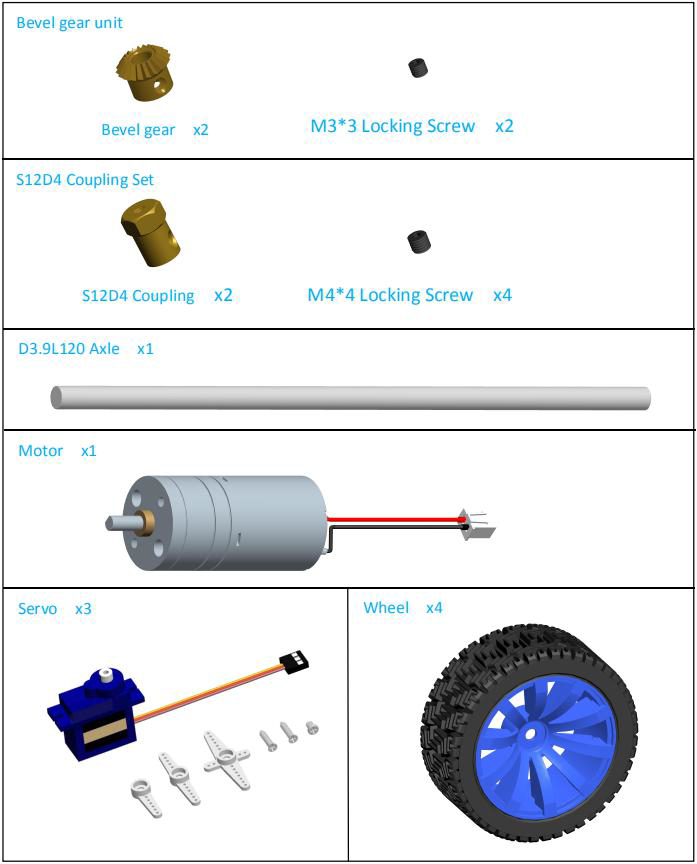

Electronic Parts


Tools


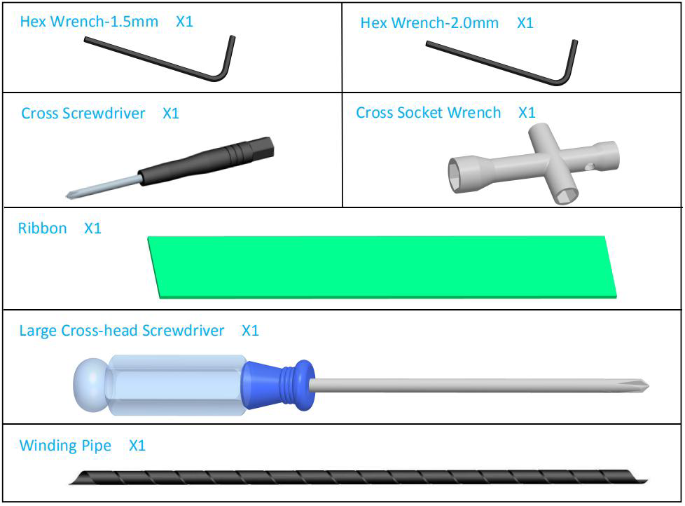

Self-prepared Parts


## Content	

----
* [Getting Started with Raspberry Pi Robot and Python](#getting-started-with-raspberry-pi-robot-and-python)
    * [1. Premise](#1-premise)
       * [1.1 STEAM and Raspberry Pi](#11-steam-and-raspberry-pi)
       * [1.2 About the Documentation](#12-about-the-documentation)
    * [2. Raspberry Pi System Installation and Development Environment Establishment                                                               3
		* [2.1 Install An Operating System for The Raspberry Pi                                                                                                                   3
		* [2.1.1 Method A: Write 'Raspbian' to The SD Card by Raspberry Pi Imager                                                                      3
		* [2.1.2 Method B: Download The Image File Raspbian and Write It to The SD Card Manually                                       5
		* [2.1.3  Method  C:  Manually  Download  The  Image  File  Provided  by  Us  and  Write  It  to  The  SD  Card  (Not Recommended)                                                                                                                                                                           8
		* [2.2 Enable SSH Server of Raspberry Pi                                                                                                                                           10
		* [2.2.1 Method A: Enable SSH with Peripherals                                                                                                                     11
		* [2.2.2 Method A: Enable SSH without Peripherals                                                                                                               11
		* [2.3 Configure WiFi on Raspberry Pi                                                                                                                                                12
		* [2.3.1 Method A: WiFi Connection with Peripherals                                                                                                           12
		* [2.3.2 Method A: WiFi Connection without Peripherals                                                                                                     12
    * [3 Log In to The Raspberry Pi and Install The App                                                                                                                         14
       * [3.1 Log into Raspberry Pi (Windows 10)                                                                                                                                        14
       * [3.2 Log into Raspberry Pi (Linux or Mac OS)                                                                                                                                 15
       * [3.3 Log into Raspberry Pi (Windows 8 or Previous Version)                                                                                                      15
       * [3.4 Download Program of The Raspberry Pi Robot                                                                                                                     16
       * [3.5 Install Corresponding Dependent Libraries                                                                                                                            17
       * [3.6 Run the Raspberry Pi Robot's Program                                                                                                                                   17
    * [4 Raspberry Pi Structure Assembly and Precautions                                                                                                                   18
       * [4.1 Documentation for Structure Assembly                                                                                                                                 18
       * [4.2 Tips for Structural Assemblage                                                                                                                                                 70
       * [4.3 Tips for Power Provision                                                                                                                                                            70
    * [5 Controlling Robot via WEB App                                                                                                                                                    71
    * [6 Common Problems and Solutions(Q&A)                                                                                                                                    74


    * [7 Set The Program to Start Automatically 	77
       * [7.1 Set The Specified Program to Run Automatically at Boot                                                                                                    77
       * [7.2 Change The Program That Starts Automatically                                                                                                                    77
    * [8 Remote Operation of Raspberry Pi Via MobaXterm                                                                                                                 78
    * [9 How to Control WS2812 RGB LED                                                                                                                                                80
    * [10 How to Control The Servo                                                                                                                                                           82
       * [10.1 Control The Steering Gear to Rotate to A Certain Angle                                                                                                   82
       * [10.2 Control The Slow Motion of The Steering Gear                                                                                                                  84
       * [10.3 Non-blocking Control                                                                                                                                                               84
    * [11 How to Control DC Motor                                                                                                                                                           85
    * [12 Ultrasonic Module                                                                                                                                                                        88
    * [13 Line Tracking                                                                                                                                                                                  90
    * [14 Make A Police Light or Breathing Light                                                                                                                                     93
       * [14.1 Multi-threading Introduction                                                                                                                                                  93
       * [14.2 Realization of Police Lights / Breathing Lights                                                                                                                     93
       * [14.3 Warning Lights or Breathing Lights in Other Projects                                                                                                        98
    * [15 Real-Time Video Transmission                                                                                                                                                    99
    * [16 Automatic Obstacle Avoidance                                                                                                                                                103
    * [17 Why OpenCV Uses Multi-threading to Process Video Frames                                                                                           106
       * [17.1 Single Thread Processing of Video Frames                                                                                                                        106
       * [17.2 Multi-thread Processing of Video Frames                                                                                                                          107
    * [18 OpenCV Learn to Use OpenCV                                                                                                                                                 111
    * [19 Using OpenCV to Realize Color Recognition and Tracking                                                                                                  115
       * [19.1 Color Recognition and Color Space                                                                                                                                     115
       * [19.2 Process of Color Identifying and Tracking                                                                                                                          115
       * [19.3 Specific Code                                                                                                                                                                           116
       * [19.4 HSV Color Component Range in OpenCV                                                                                                                           119
    * [20 Machine Line Tracking Based on OpenCV                                                                                                                              120
       * [20.1 Visual Line Inspection Process                                                                                                                                              120
       * [20.2 Specific Code                                                                                                                                                                           121
    * [21 Speech Recognition                                                                                                                                                                    123
       * [21.1 Specific Code                                                                                                                                                                           123
    * [22 Radar Scan                                                                                                                                                                                   125
       * [22.1 Specific Code                                                                                                                                                                           125
    * [23 Create A WiFi Hotspot on The Raspberry Pi                                                                                                                          127
    * [24 Install GUI Dependent Item under Window                                                                                                                          128
       * [24.1 Install GUI Dependencies                                                                                                                                                      128
    * [25 How to Use GUI                                                                                                                                                                           129
    * [26 Control The WS2812 LED via GUI                                                                                                                                            129
    * [27 Real-time Video Transmission Based on OpenCV                                                                                                                 134
    * [28 Use OpenCV to Process Video Frames on The PC                                                                                                                137
    * [29 Enable UART                                                                                                                                                                                141
       * [29.1 Mini UART and CPU Core Frequency                                                                                                                                   141
       * [29.2 Disabling Linux's Use of Console UART                                                                                                                               142
       * [29.3 UART Output on GPIO Pins                                                                                                                                                   142
       * [29.4 UARTs and Device Tree                                                                                                                                                           142
       * [29.5 Relevant Differences Between PL011 and Mini UART                                                                                                     143
    * [ 30 Control Your PiCar-B with An Android Device                                                                                                                       143
    * [ Conclusion                                                                                                                                                                                                 145


## 1. Premise
### 1.1 STEAM and Raspberry Pi
STEAM stands for Science, Technology, Engineering, Arts and Mathematics. It's a type of transdisciplinary education idea focused on practice. 
As a board designed for computer programming education, Raspberry Pi has lots of advantages over other robot development boards. Therefore, Raspberry Pi is used for function control of the robot. 

### 1.2 About the Documentation 
This documentation is for software installation and operation guide for the Python robot product. It describes every detail of the whole process of fulfilling the robot project by Python and Raspberry Pi from scratch as well as some precautions. Hope you can get started with the Raspberry Pi robot on Python and make more creations with this documentation.   

According to the different situations of different users, there will be some changes in the process of this document, you can refer to the following process: 

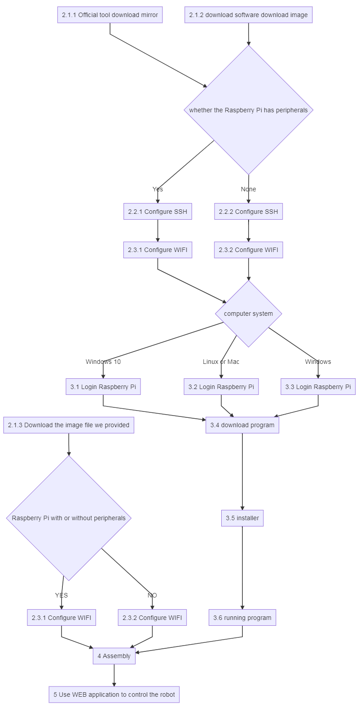


## 2. Raspberry Pi System Installation and Development Environment Establishment

### 2.1 Install An Operating System for The Raspberry Pi


#### 2.1.1 Method A: Write 'Raspbian' to the SD card by `Raspberry Pi Imager`
`Raspberry Pi Imager` is an image writing tool to SD card developed by the Raspberry Pi Organization. It comes with many versions working on different systems and it's quite easy to use; all you need is choose the operating system and SD card, Raspberry Pi Imager will download the corresponding image file for the system and install it to the SD card.

**Step-by-Step Overview**  

1. Prepare an SD card (16G or larger) and an SD card reader
2. Download the `Raspberry Pi Imager` on the official website [Official Raspberry Pi website](https://www.raspberrypi.org/downloads/ )
    - [Raspberry Pi Imager for Windows](https://downloads.raspberrypi.org/imager/imager.exe) "Click here to download Raspberry Pi Imager for Windows."
    - [Raspberry Pi Imager for macOS](https://downloads.raspberrypi.org/imager/imager.dmg) "Click here to download Raspberry Pi Imager for macOS."
    - [Raspberry Pi Imager for Ubuntu](https://downloads.raspberrypi.org/imager/imager_amd64.deb) "Click here to download Raspberry Pi Imager for Ubuntu."
3. Install the `Raspberry Pi Imager`
4. Write the operating system for Raspberry Pi to the SD card with `Raspberry Pi Imager` `Raspbian Full - A port of Debian with desktop and recommended application`  
5. Leave the SD card connected after writing is completed, we'll use for configuring SSH and WiFi connection later.

**Detailed Steps:**  

- Open a web browser on your computer, go to the Raspberry Pi website [Official Raspberry Pi website](https://www.raspberrypi.org/downloads/ ), find and download the `Raspberry Pi Imager` for your computer OS, or click on the links above for the corresponding system to directly download and install.   

  

- Insert the SD card into the card reader, connect the card reader and your computer.   

- Run the `Raspberry Pi Imager`, select `CHOOSE OS` -> `Raspbian(other)` -> `Raspbian Full - A port of Debian with desktop and recommended applications`. 

- Click on `CHOOSE SD CARD` for the SD card to write the `Raspbian Full`, please be noted that the image writing will automatically delete all files on the SD card if any.  

- Click on `WRITE`, wait for the writing. The `Raspberry Pi Imager` needs to download the `Raspbian` image file during the process. You can download the file following the step in **2.1.2**.  

  

- Do not remove the SD card connected when writing is completed, we'll use for configuring SSH and WiFi connection later. Otherwise, if you remove the card, insert it into the Raspberry Pi and boot, WiFi configuration without any peripherals may fail in the following process.


#### 2.1.2 Method B: Download the image file `Raspbian` and write it to the SD card manually
Since the image file is downloaded with the `Raspberry Pi Imager` in **2.1.1**, it can take a long time due to a slow network in some places. You may then manually download the image file `Raspbian` and write it to the SD card with th `Raspberry Pi Imager`.  

**Step-by-Step Overview**

1. Prepare an SD card (16G or larger) and an SD card reader
2. Download the `Raspberry Pi Imager` on the official website [Official Raspberry Pi website](https://www.raspberrypi.org/downloads/ )
    - [Raspberry Pi Imager for Windows](https://downloads.raspberrypi.org/imager/imager.exe) "Click here to download Raspberry Pi Imager for Windows."
    - [Raspberry Pi Imager for macOS](https://downloads.raspberrypi.org/imager/imager.dmg) "Click here to download Raspberry Pi Imager for macOS."
    - [Raspberry Pi Imager for Ubuntu](https://downloads.raspberrypi.org/imager/imager_amd64.deb) "Click here to download Raspberry Pi Imager for Ubuntu."
3. Install the `Raspberry Pi Imager`
4. Download the image file `Raspbian`
    - Torrent file: 
    [Raspbian - Raspbian Buster with desktop and recommended software](https://downloads.raspberrypi.org/raspbian_full_latest.torrent "Link to download the torrent file for image")
    - Zip file: [Raspbian - Raspbian Buster with desktop and recommended software](https://downloads.raspberrypi.org/raspbian_full_latest "Link to download the zip file for image")
5. Unzip the file, be noted that the path should be in English for the `.img` file extracted, no special characters allowed.
6. Write the image file `Raspbian` downloaded to the SD card with `Raspberry Pi Imager`
7. Leave the SD card connected after writing is completed, we'll use for configuring SSH and WiFi connection later.

**Detailed Steps:**

- Open a web browser on your computer, go to the Raspberry Pi website[Official Raspberry Pi website], find and download the `Raspberry Pi Imager` for your computer OS, or click on the links above for the corresponding system to directly download and install.   

  

- On the Raspberry Pi website [Official Raspberry Pi website](https://www.raspberrypi.org/downloads/ ), select through `Downloads` -> `Raspbian` -> `Raspbian Buster with desktop and recommended software`, and click on the torrent or zip file to download. Unzip the file after download, be noted that the path should be in English for the `.img` file extracted, no special characters allowed; otherwise `Raspberry Pi Imager` may not open the `.img` file. It's recommended to save the `.img` file to the root directory of the `C:\` or `D:\` disk, **but do not save `.img` on the SD card**.  

  

- Insert the SD card into the card reader, connect the card reader and your computer.   

- Run the `Raspberry Pi Imager`, select `CHOOSE OS`, and then `Use custom` to find the `.img` extracted, click `Open`. 

- Select `CHOOSE SD CARD` for the SD card to write the `Raspbian`, please be noted that the image writing will automatically delete all files on the SD card if any.  

- Click on `WRITE`, wait for the writing. 

  

- Do not remove the SD card connected when writing is completed, we'll use for configuring SSH and WiFi connection later. Otherwise, if you remove the card, insert it into the Raspberry Pi and boot it up, WiFi configuration without any peripherals may fail in the following process.  

#### 2.1.3 Method C: Manually download the image file provided by us and write it to the SD card (not recommended)
The Raspbian image file downloaded in **2.1.1** and **2.1.2** is the official source with some preinstalled software. To operate the robot, you may need many dependent libraries. Though we provide the simple script to install them (see details later), failure can happen during installation if the library is not the latest version. Therefore, despite we provide the downloading of the Raspbian image file, it may happen that our image file and the dependent libraries are not most updated versions. Please only use when you encounter the most troublesome situation.   
**Step-by-Step Overview**  

1. Prepare an SD card (16G or larger) and an SD card reader
2. Download the `Raspberry Pi Imager` from the official website [Official Raspberry Pi website](https://www.raspberrypi.org/downloads/ )
    - [Raspberry Pi Imager for Windows](https://downloads.raspberrypi.org/imager/imager.exe "Click here to download Raspberry Pi Imager for Windows")
    - [Raspberry Pi Imager for macOS](https://downloads.raspberrypi.org/imager/imager.dmg "Click here to download Raspberry Pi Imager for macOS")
    - [Raspberry Pi Imager for Ubuntu](https://downloads.raspberrypi.org/imager/imager_amd64.deb "Click here to download Raspberry Pi Imager for Ubuntu")
3. Install the `Raspberry Pi Imager`
4. Download the image file `Adeept_PiCar-B`
    - [Image file for the Adeept_PiCar-B Robot](https://www.adeept.com/learn/detail-33.html)
	5. Unzip the file, be noted that the path should be in English for the `.img` file extracted, no special characters allowed.
6. Write the image file `Raspbian` downloaded to the SD card with `Raspberry Pi Imager`
7. Leave the SD card connected after writing is completed, we'll use for configuring SSH and WiFi connection later.

**Detailed Steps:**  

- Open a web browser on your computer, go to the Raspberry Pi website [Official Raspberry Pi website](https://www.raspberrypi.org/downloads/ ), find and download the `Raspberry Pi Imager` for your computer OS, or click on the links above for the corresponding system to directly download and install.  

  
- Go to our [official website], find and download the image file [Image file for the Adeept_PiCar-B Robot](https://www.adeept.com/learn/detail-33.html).

- Unzip the file, be noted that the path should be in English for the .img file extracted, no special characters allowed. otherwise Raspberry Pi Imager may not open the .img file. It's recommended to save the .img file to the root directory of the C:\ or D:\ disk, but do not save .img on the SD card."

- Insert the SD card into the card reader, connect the card reader and your computer.   

- Run the `Raspberry Pi Imager`, select `CHOOSE OS`, and then `Use custom` to find the `.img` extracted, click `Open`.

- Select `CHOOSE SD CARD` for the SD card to write the `Raspbian`, please be noted that the image writing will automatically delete all files on the SD card if any.  
- Click on `WRITE`, wait for the writing.  

  

- Do not remove the SD card connected when writing is completed, we'll use for configuring SSH and WiFi connection later. Otherwise, if you remove the card, insert it into the Raspberry Pi and boot it up, WiFi configuration without any peripherals may fail in the following process.  

### 2.2 Enable SSH Server of Raspberry Pi 
- By SSH (Secure Shell) server, you can use the command line of Raspberry Pi remotely on another device. In the subsequent operation and when using the Raspberry Pi, you don't have to connect a mouse, keyboard, or monitor to it, but simply control it on a computer in the same LAN.   
- As of the November 2016 release, Raspbian has the SSH server disabled by default. You will have to enable it manually.  
- The method to enable the SSH in this documentation can be referred to the Raspberry Pi official website [SSH(Secure Shell)](https://www.raspberrypi.org/documentation/remote-access/ssh/)  

#### 2.2.1 Method A: Enable SSH with peripherals

- If you use (2.1.3 to manually download the image file we provide and write it to the SD card) to write the operating system of the Raspberry Pi to the SD card, you do not need to refer to this section to open SSH, because The SSH service in the image is already enabled.
- If you've connected a mouse, keyboard, or monitor to the Raspberry Pi, follow these steps to enable SSH.   

    1. Remove the SD card from the computer, insert it to the Raspberry Pi, connect a mouse, keyboard, and monitor to the Raspberry Pi, boot it up.   
    2. Go to `Preferences` menu, select `Raspberry Pi Configuration`.
    3. Go to `Interfaces` option. 
    4. Select `Enable` next to `SSH`.
    5. Click on `OK`.  
    
    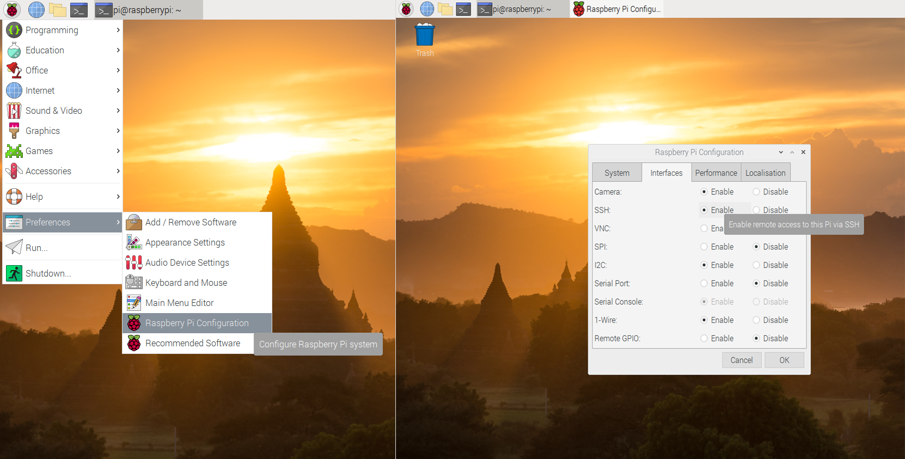

#### 2.2.2 Method A: Enable SSH without peripherals
- If you haven't connected any monitor to the Raspberry Pi, follow these steps to enable SSH.  

    1. Do not remove the SD card after `Raspberry Pi Imager` writes the image file.  

    2. Create a file named `ssh` under any directory, without any extension name. You may create a `ssh.txt` and delete the `.txt` (make sure under Folder Options the box of Hide extensions for known file types is unchecked. Then you have an `ssh` file without extension name.   

    3. Copy the `ssh` file and paste to the root directory of the SD card. The Raspberry Pi will auto search for the `ssh` file when booting, and enable SSH if the file is found. You only need to copy for one time because the Raspberry Pi then will automatically enable SSH at every boot.   

    4. Do not remove the SD card if you need to configure WiFi. 

### 2.3 Configure WiFi on Raspberry Pi 
There are many ways to connect WiFi for Raspberry Pi. Two methods are provided in this documentation; you may visit the official Raspberry Pi website for more: [Wireless connectivity](https://www.raspberrypi.org/documentation/configuration/wireless/README.md).
#### 2.3.1 Method A: WiFi connection with peripherals 
- If you've connected a mouse, keyboard, or monitor to the Raspberry Pi, follow these steps to configure WiFi. 

    1. Remove the SD card from the computer, insert it to the Raspberry Pi, connect a mouse, keyboard, and monitor to the Raspberry Pi, boot it up.   
    2. Select the WiFi icon at the top right corner on the monitor, find the WiFi to connect and select.
    3. Type in the password for the WiFi, connect. 
    4. After it's connected successfully, the WiFi will be saved and the Raspberry Pi will auto connect for next boot, so you don't need to connect peripherals every time. 

#### 2.3.2 Method A: WiFi connection without peripherals 
- If you haven't connected any monitor to the Raspberry Pi, follow these steps to configure WiFi.  
- This method is based on the [official documentation](https://www.raspberrypi.org/documentation/configuration/wireless/headless.md)  

    1. Do not remove the SD card after `Raspberry Pi Imager` has written the image file. (This method works for the situation that the Raspbian image file has just been written to the SD card; if you've already plugged the SD card into the Raspberry Pi and got it rebooted after the image file being written, the configuration may fail.)  

    2. Create a file named `wpa_supplicant.conf` anywhere in your computer.   
    
    3. Open the file `wpa_supplicant.conf` created with Textbook, enter the following code:   

    ```
    ctrl_interface=DIR=/var/run/wpa_supplicant GROUP=netdev
    update_config=1
    country=Insert country code here
    network={
     ssid="Name of your WiFi"
     psk="Password for your WiFi"
    }
    ```

    4. Type in your own information for `Insert country code here`, `Name of your WiFi`, and `Password for your WiFi`. Pay attention to the capitalization. Refer to the example below:   

    ```
    ctrl_interface=DIR=/var/run/wpa_supplicant GROUP=netdev
    update_config=1
    country=USA
    network={
     ssid="MyName"
     psk="12345678"
    }
    ```

    5. Save and exit. Copy the `wpa_supplicant.conf` to the root directory of the SD card.   

    6. If you've alreay copied the file `ssh` to the SD card as instructed in **2.2**, then both the WiFi and SSH settings without peripherals are done. You may remove the SD card, insert it into the Raspberry Pi, and boot it up.   
    
    7. For more about the file `wpa_supplicant.conf`, refer to the official documentation [WIRELESS-CLI](https://www.raspberrypi.org/documentation/configuration/wireless/wireless-cli.md)

## 3. Log In to The Raspberry Pi and Install The App
- If you followed the steps in **2.2.1** and **2.3.1** for SSH and WiFi configuration, you may remove the peripherals now and use SSH to remotely control the Raspberry Pi later on.   

- If you followed the steps in **2.2.2** and **2.3.2**, you may now insert the SD card into the Raspberry Pi and boot it up. The Raspberry Pi will auto boot and connect WiFi when powered on, with no need of peripherals.

- Some steps mentioned below are based on the official Raspberry Pi documentation [SSH](https://www.raspberrypi.org/documentation/remote-access/ssh/).  

- For power supply of the Raspberry Pi, refer to the official documentation [Power supply](https://www.raspberrypi.org/documentation/hardware/raspberrypi/power/README.md).

- The Robot HAT board of the Adeept Raspberry Pi Robot can supply power for the Raspberry Pi via GPIO port. However, since it may take a long time to install software on the Raspberry Pi, it's not recommended to supply with the batteries during this process. You may skip the installation of the Robot HAT board or camera during software installation; though you need to make sure the driver board and camera for the Raspberry Pi when it's ready yto run the software installed, or a program error will occur.  

### 3.1 Log into Raspberry Pi (Windows 10)
- For Windows 10, SSH is built in the versions after October 2018, so you don't need any third-party software.   

- For lower versions of Windows OS, SSH is not built in, and you may log into the Raspberry Pi by referring to the official documentation [SSH using Windows](https://www.raspberrypi.org/documentation/remote-access/ssh/windows.md). 

- Before connecting the Raspberry Pi via SSH, you need to know the IP address of the Raspberry Pi. Check the Management interface for your router, or download the app `Network Scanner` -> search for a device named `RASPBERRY` or `Raspberry Pi Foundation` to get the IP address.  

- For other methods of obtaining the IP address of Raspberry Pi, refer to the official documentation [IP Address](https://www.raspberrypi.org/documentation/remote-access/ip-address.md)  

- Press the keys <kbd>win</kbd>+<kbd>R</kbd>, type in `cmd`, and press <kbd>enter</kbd>.

- The default user is `pi`, and the password is `raspberry`. 

- Type in `ssh pi@<IP>` in the command line, replace the `<IP>` with the IP address of your Raspberry Pi, as shown below:  

    >ssh pi@192.168.3.161  

- Press Enter key and a prompt will appear: `Are you sure you want to continue connecting (yes/no)?`  

- Type in `yes`, press Enter and it'll show `pi@192.168.3.161's password:`, type in the initial password of the Raspberry Pi, `raspberry` (pay attention to capitalization). There's no change on the screen when you're typing in, but it doesn't mean you're not entering the information. Press <kbd>enter</kbd> after you finish typing in. 

- So now you've logged into the Raspberry Pi.   


### 3.2 Log into Raspberry Pi (Linux or Mac OS)

- Before connecting the Raspberry Pi via SSH, you need to know the IP address of the Raspberry Pi. Check the Management interface for your router, or download the app `Network Scanner` -> search for a device named `RASPBERRY` or `Raspberry Pi Foundation` to get the IP address.  

- For other methods of obtaining the IP address of Raspberry Pi, refer to the official documentation [IP Address](https://www.raspberrypi.org/documentation/remote-access/ip-address.md)  

- Open the terminal window (or command line)   

- The default user is `pi`, and the password is `raspberry`. 

- Type in `ssh pi@<IP>` in the command line, replace `<IP>` with the IP address of your Raspberry Pi as shown below:   

    >ssh pi@192.168.3.161  

- Press Enter key and a prompt will appear: `Are you sure you want to continue connecting (yes/no)?`  

- Type in `yes`, press Enter and it'll show `pi@192.168.3.161's password:`, type in the initial password of the Raspberry Pi, `raspberry` (pay attention to capitalization). There's no change on the screen when you're typing in, but it doesn't mean you're not entering the information. Press <kbd>enter</kbd> after you finish typing in.   

- So now you've logged into the Raspberry Pi.   

### 3.3 Log into Raspberry Pi (Windows 8 or Previous Version)
- For lower versions of Windows OS, SSH is not built in, and you may log into the Raspberry Pi by referring to the official documentation Raspberry Pi [SSH using Windows](https://www.raspberrypi.org/documentation/remote-access/ssh/windows.md).  
- Before connecting the Raspberry Pi via SSH, you need to know the IP address of the Raspberry Pi. Check the Management interface for your router, or download the app `Network Scanner` -> search for a device named `RASPBERRY` or `Raspberry Pi Foundation` to get the IP address.  
- For other methods of obtaining the IP address of Raspberry Pi, refer to the official documentation [IP Address](https://www.raspberrypi.org/documentation/remote-access/ip-address.md)  
- You may need to download the `PuTTY` version for your OS and log into Raspberry Pi with the tool. [Click here to download PuTTY](https://www.chiark.greenend.org.uk/~sgtatham/putty/latest.html)  
- Run `PuTTY`, type in the IP address of Raspberry Pi for `Host Name`, and click <kbd>Open</kbd>.  
- If a prompt of `Network error: Connection timed out` appears, possibly you've entered an incorrect IP address.   
- When the connection works you will see the security warning shown below. You can safely ignore it, and click the 'Yes' button. You will only see this warning the first time PuTTY connects to a Raspberry Pi that it has not seen before.  
- You will now see the usual login prompt. Log in with the same username and password you would use on the Pi itself. The default login for Raspbian is `pi` with the password `raspberry`.  
- You should now have the Raspberry Pi prompt which will be identical to the one found on the Raspberry Pi itself.  


### 3.4 Download Program of the Raspberry Pi Robot 

- The code for the robot product has been uploaded to [GitHub](https://github.com/adeept/adeept_picar-b.git), you may need to download to your Raspberry Pi and install the corresponding dependent libraries to run the program.   

- In the previous section you've logged into the Raspberry Pi, and here type in the follow command in the terminal window:

    >sudo git clone https://github.com/adeept/adeept_picar-b.git

- Press <kbd>enter</kbd> to start downloading the program of the robot from GitHub. It may take some time, please wait until it's done.  

### 3.5 Install Corresponding Dependent Libraries 
- Follow the steps below to install the libraries if you wrote the image file to the SD card based on **2.1.1 Write 'Raspbian' to the SD card by `Raspberry Pi Imager`** and **2.1.2 Download the image file `Raspbian` and write it to the SD card manually**.   

- But you should **skip this section** if you wrote the image file to the SD card based on **2.1.3 Manually download the image file provided by us and write it to the SD card**; refer to **2.4.5** for configuration of auto start program. 

- Here a script is provided for installing all dependent libraries needed and configuration of starting the camera and other auto start programs.   

- Type in the code below in the terminal window to run the dependent libraries for the script `setup.py`:  

    >sudo python3 adeept_picar-b/setup.py

- Press <kbd>enter</kbd> and the script will auto run. This may take minutes or hours, depending on the network status. Please wait until it's done.  

- After installation is completed, the following prompts will appear: 

    >The program in Raspberry Pi has been installed, disconnected and restarted.  
    >You can now power off the Raspberry Pi to install the camera and driver board (Motor HAT). After turning on again, the Raspberry Pi will automatically run the program to set the servos port signal to turn the servos to the middle position, which is convenient for mechanical assembly.

- When installation is completed, the Raspberry Pi will automatically disconnect SSH and reboot. If you used puTTy to connect the Raspberry Pi, there can be an error prompt like `Network error:Software caused connection abort`. You can just ignore and close it.  

### 3.6 Run the Raspberry Pi Robot's Program

- Raspberry Pi auto runs the program for the robot when rebooting every time, which is the part `[RobotName]/server/webServer.py` (replace `[RobotName]` for the name of the folder for your robot product's program). However, if the Raspberry Pi camera or Motor Hat is not connected, the `webServer.py` can't run well. It makes sense because the robot's program needs the camera and the chipset PCA9685. Motor Hat controls servo with PCA9685; the Raspberry Pi communicates with PCA9685 via I2C; so if Robot HAT is not connected to Raspberry Pi, a program error will occur when instantiating dependent libraries for PCA9685 due to communication failure. 

- Power off the Raspberry Pi, connect camera module and Motor Hat, reboot it up and now `webServer.py` can run.   

- Generally you don't need to manually run `webServer.py` since it's auto run by Raspberry Pi at every boot.   

- Open a web browser (Google Chrome for example), in the address bar type in the IP address of the Raspberry Pi, add `:5000` to the end as shown below, and press <kbd>enter</kbd> to redirect to the webpage of the Raspberry Pi:   

    >http://192.168.3.161:5000/

- If it fails to enter the page, log into the Raspberry Pi via SSH, type in the command below to end the program auto run at boot to release resources, or else issues like camera initialization failure or occupied ports.   

    >sudo killall python3

- Type in the command below to run `webServer.py`: 

    >sudo python3 adeept_rasptank/server/webServer.py  

- Check whether there's any error and solve them based on instructions in the Q&A section below.   

## 4. Raspberry Pi Structure Assembly and Precautions

#### 4.1 Documentation for structure assembly
- [Documentation for structure assembly](https://www.adeept.com/learn)

Before assembling
Before installing the robot, `you need to install the software (refer to second half of the document) to control the robot on the Raspberry Pi`. Because the servo needs to be returned to the original position during the robot assembly process, which requires the assistance of a Raspberry Pi with software that runs normally.

`How to make a servo return to original position`

Connect the servo to the Raspberry Pi that is `turned on`. When the connection is completed, the servo will immediately run, and it will automatically return to the original position in a very short time. Then you can install the rocker arm on the servo at a specified angle."

automatically return ➔ install rocker arm


`(The type of servo and the installation angle of the rocker arm is for reference only. Please refer to the actual product and assembly part.)`

Whether the servo has returned to original position

You can test whether the servo has returned to original position by pulling the rocker arm (don't try too hard to prevent damage to the servo). The servo that has automatically returned cannot be pulled.

#### 4 Raspberry Pi Structure Assembly and Precautions


If your servo does not return to the original position automatically, you can manually run the server.py file and then try to connect the servo.

- Preparations before Assembly
1. Connect the Raspberry Pi Camera and the ribbon.

2. Connect the Adeept Ultrasonic Module with 4-Pin wires.

The connection diagrams of the remaining modules and wires are as follows：


3. Screw the M3*3 Locking Screw into the bevel gear (2 sets).

4. Screw the M4*4 Locking Screw into the S12D4 Coupling (2 sets).

- Car Light and Battery Holder Assembly
1. Fix two M3*12 Copper Standoff on A01.


2. Fix A06 on A01.
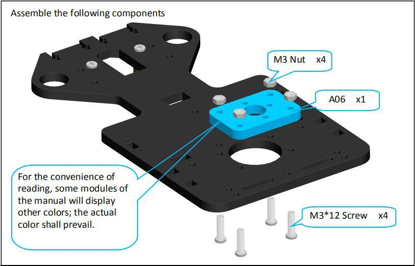

3. Fix M2*6 Copper Standoff on A01.


4. Fix one 3-CH WS2812 RGB LED-A on M2*6 Copper Standoff.


5. Follow step 3 and 4, fix another 3-CH WS2812 RGB LED-A on A01.

6. Fix 18650x2 Battery Holder on A01.


7. Fix one 3-CH WS2812 RGB LED-A and 3-CH WS2812 RGB LED-B respectively on both sides of the A02 .


8. Fix A02 on A01.


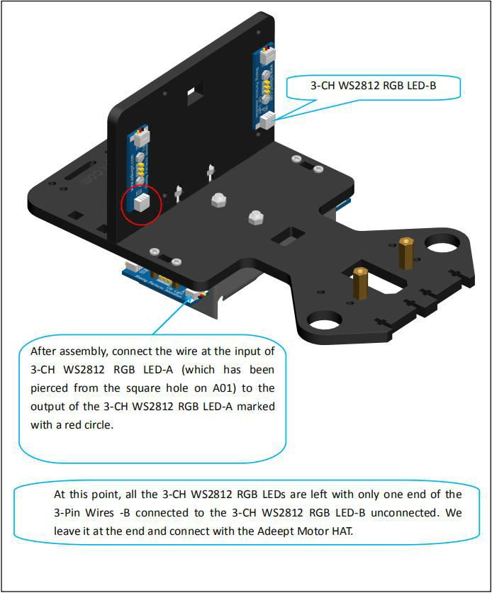

- Rear wheel assembly
1. Fix the bevel gear on the Motor.

2. Fix Motor on A06.

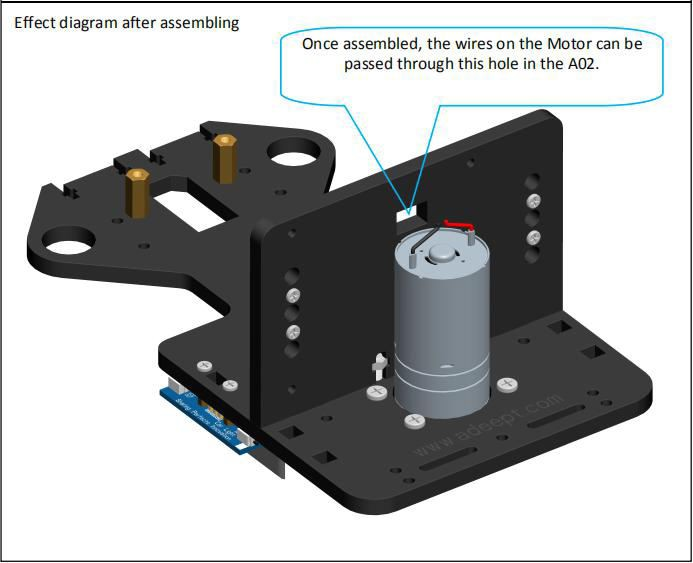
3. Fix four M3*30 Copper Standoff on A01.

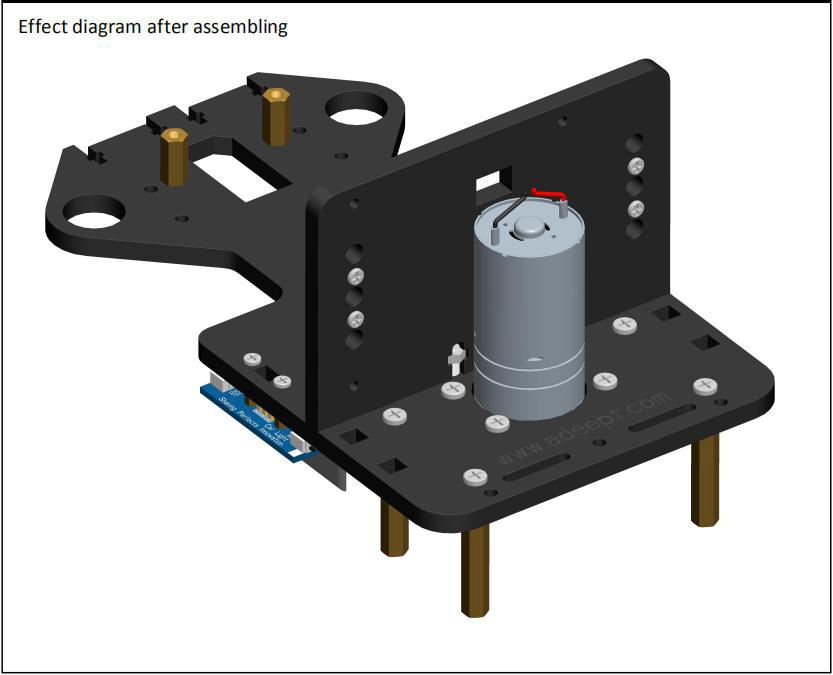
4. Then fix the A04 on the M3*30 Copper Standoff.


5. Take one S12D4 Coupling and fix it on the D3.9L120 Axle.

6. Then pass the D3.9L120 Axle through the A10.

7. Take another S12D4 Coupling and fix it on the D3.9L120 Axle.


8. Fix the tire on the S12D4 Coupling.
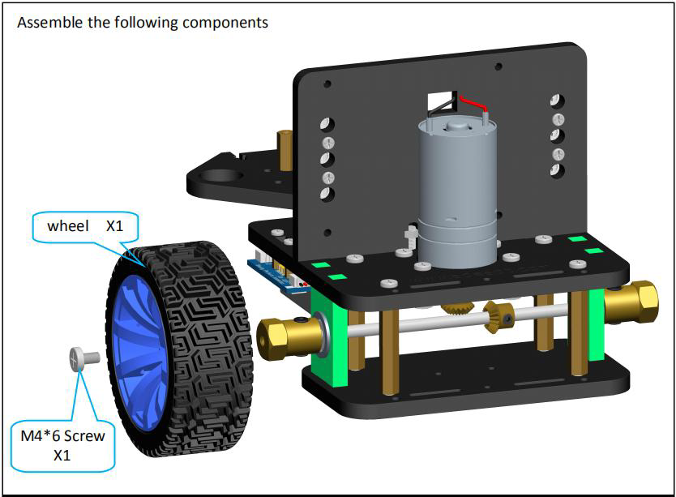

9. In the same way, fix another S12D4 Coupling to a tire.

10. Fix the bevel gear on the D3.9L120 Axle.


- Front wheel assembly
1. Fix 3-CH Line Tracking Module on A03.


2. Fix two 3*12 Copper Standoff on A03.
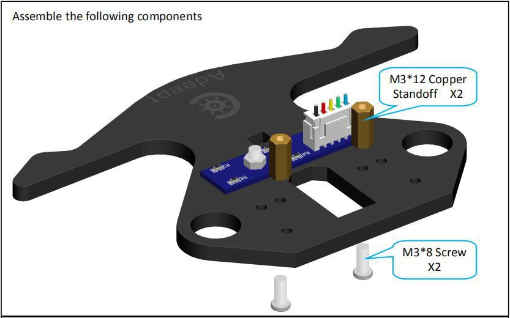

3. Calibrate the servos.

Now adjust the servo. This step is to make the servo shaft in the middle, so the component connected to the servo can be driven to move in a certain scope as needed.


4. Take two servos and fix them with A09 respectively.

5. Fix the assembled servo to the M3*12 Copper Standoff on the A03.
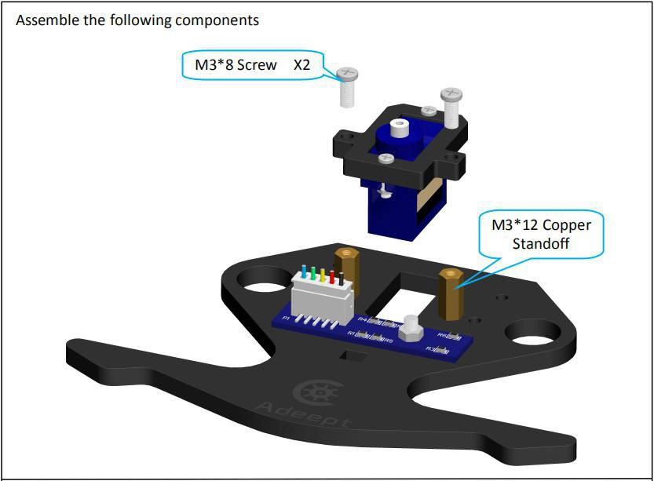

6. Fix four M3*30 Copper Standoff on A03.


7. Connect the rocker arm of a servo with A07.

8. Two front wheels assembly.

9. Fix the rocker arm on the A07 to the servo on the A03.

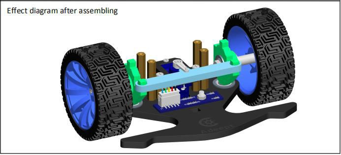
10. Fix the M3*30 Copper Standoff on A01 and A03.


11. Fix Adeept RGB LED Module on A05.
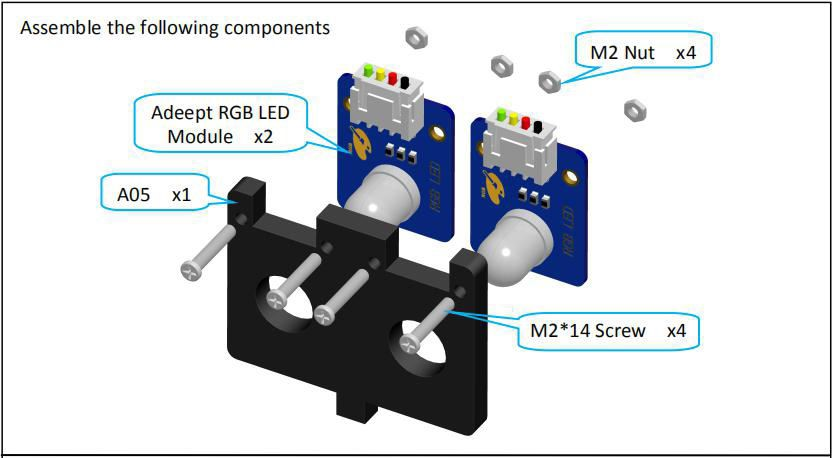

12. Fix Adeept RGB LED Module and A05 on A01.


- Front part assembly
1. Fix Raspberry Pi Camera to A18.

2. Fix the Adeept Ultrasonic Module to the A18.

3. Take a servo and fix it with A15.
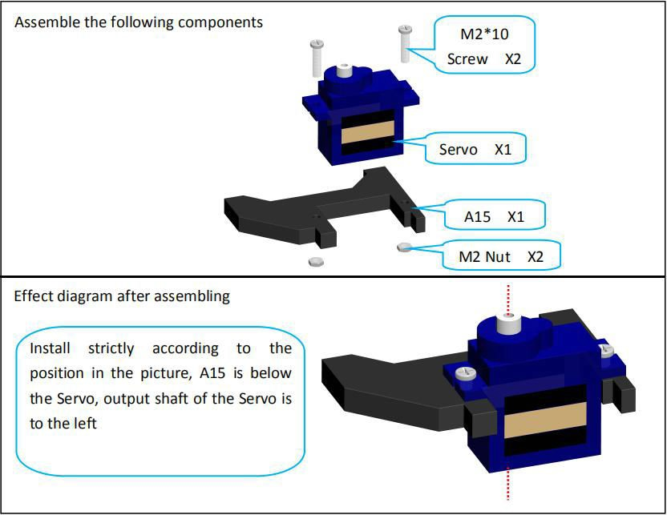
4. Fix three M3*30 Copper Standoff to A17.

5. Insert A16 into A17.

6. Insert A15 into A17.
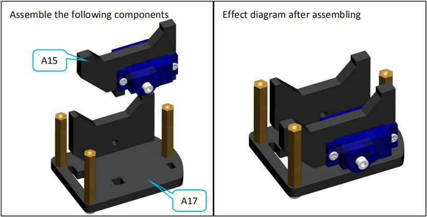
7. Fix the A18 to the M3*30 Copper Standoff on the A17.

8. Install a rocker arm on the servo.

9. Fix A13 with servo.

10. Select a 'cross' rocker arm and fix to the A12.

11. Then fix the rocker arm to the servo assembled with A09.

12. Fix M3*18 Screw on A14.

13. Insert A13, A14 into A12."

14. Then use A3*12 Screw to fix A13 and A14 to A12.

15. Fix the assembly completed in the previous step on the M3*12 Copper Standoff on the A1.


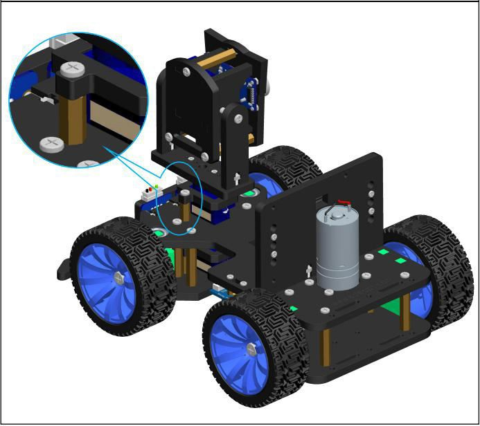
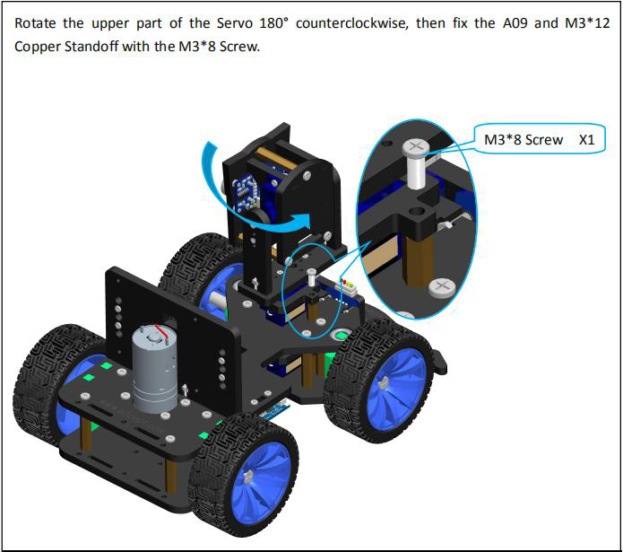


Finally turn the upper part of the servo back to original position.

- Raspberry Pi assembly
1. Fix M2.5*10+6 Copper Standoff and M2.5*14 Copper Standoff to Raspberry Pi.
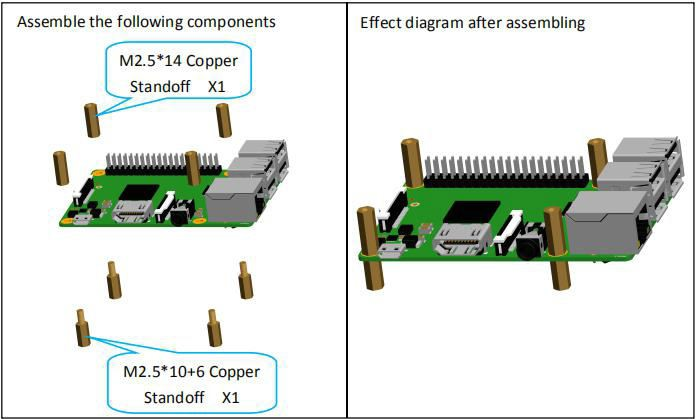
2. Connect the other end of the Raspberry P1 Camera Ribbon to the Raspberry Pi via Adeept Motor HAT and fix the Adeept Motor HAT to the Raspberry Pi.
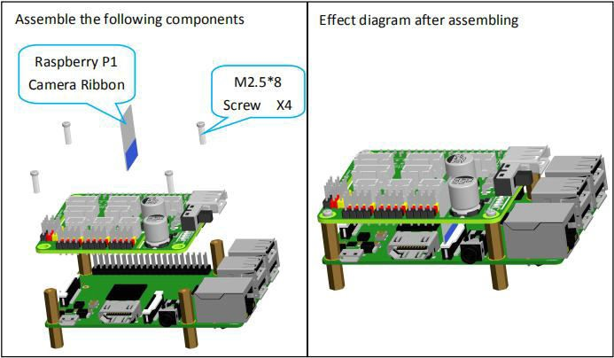
3. Fix the Raspberry Pi on the A02.


4. If you have to use the Voice Module, you need to insert it into the Raspberry Pi.


- Install and Remove Batteries


- Circuit Connection

Connect components based on the figure. Pay attention to match the wire and port and not connect inversely.
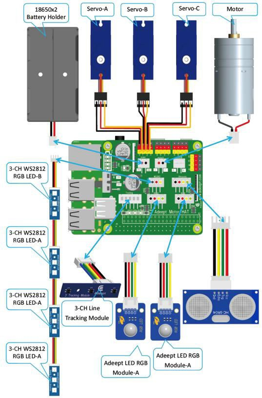

## 4.2 Tips for Structural Assemblage

- Since many servos are used in the product, the servo installation is critical for the robot. Before installing the rocker arm to the servo, you need to connect the servo to power and make the servo shaft rotate to the central position, so the rocker arm installed at the designated degree will be in the central position.
- Generally Raspberry Pi will auto run `webServer.py` when booting, when `webServer.py` will control all the ports connected to servos to send a signal of rotating to the central position. When assembling the servo, you can connect it to any servo port anytime. After connecting the servo to the port, the gears will rotate to the central position; assemble the rocker arm to the servo, disconnect the servo from the port, and insert more servos to repeat rocker arm assembly (all servos will be in the central position).
- When the servo is connected to power, try moving the rocker arm. If it can't be moved, it indicates the program   for   the   servo   works;   otherwise   there's   error   for   the   servo   program.   Run   the   line `[RobotName]/initPosServos.py` (replace `[RobotName]` with the folder name of your robot's program) to make the servo rotate to the central position.
- When booting (it may take 30-50s), it takes a while for the Raspberry Pi to control PCA9685 to set signal of all servo ports for central position rotating.

## 4.3 Tips for Power Provision

- When you install the software, assemble the structure and debug the program, you can use a USB cable to power the raspberry pi. If the raspberry pi is installed with Motor HAT, you can connect the USB cable to the USB interface on the Motor HAT. Motor HAT will supply power to the raspberry pi through the GPIO interface.
- The demand of different raspberry pi for electric current is different. For example, the raspberry pi 3B needs at least 2A of current to start up, and the raspberry pi 4 needs 3A to start up normally. You can check the specifications on your power adapter before you use the power adapter to power the raspberry pi."
- When Motor HAT is connected to a load (such as connecting to a motor or multiple servos), you need to use a power supply that supports high current to connect to Vin on Motor HAT. You can use two 18650 batteries that support high current to power Motor HAT. Our product will provide a dual 18650 battery box with 2pin interface, you can directly connect it to Motor HAT.
- When you use the USB interface on Motor HAT to supply power, Motor HAT's switch does not control whether to supply power, Motor HAT's switch can only control the power supply of Vin.
- Do not use the USB interface and Vin on the Motor HAT to supply power at the same time. If you need to debug the program for a long time and do not want to remove the battery, you can set the switch on the Motor HAT to OFF. So, when using a USB cable to connect Motor HAT, Motor HAT is powered by USB.
- If your robot restarts automatically after starting up or the robot disconnects and restarts suddenly when it starts moving after been started up normally, it is most likely because your power supply does not output enough current. When the robot is starting up, it will automatically run the program to put all the servos in the neutral position. The voltage drop caused by this process causes the raspberry pi to restart."
- We have tested that when using 7.4V power supply, the peak current of the robot is about 3.75A, so you need to use a battery that supports 4A output.
- You can also use a power lithium battery to power Motor HAT. Motor HAT supports the power supply that is below 15V.
- You can use a USB cable to supply power to Motor HAT when the installing the rocker arm of the servo during structural assembly. After the robot software is installed, the raspberry pi will control Motor HAT to set all servo ports to output the neutral signal after it is started up. At this time, you can connect the servo to any servo port, the servo gear will turn to the neutral position, and then you can install the rocker arm of the servo according to the specified angle. After the rocker arm is installed, the servo can be disconnected from Motor HAT. When you need to install the rocker arm of the second servo, you only need to connect the second servo to any servo port on the drive board."

## 5 Controlling Robot via WEB App

- The WEB app is developed for common users to control the robot in an easier way. It's convenient to use WEB app; you may use it to wirelessly control the robot on any device with a web browser (**Google Chrome was used for testing**). 
- Generally Raspberry Pi will auto run `webServer.py` when booting and establish a web server in the LAN. You may then use any other computer, mobile or tablet in the same LAN to visit the web page and control the robot.  
- How to tell whether the robot has run the `webServer.py` or not: If the WS2812-LED lights up with the breathing effect, it means the robot has booted and runs the program automatically.  
- If the program is not run when the robot is booted, try to connect Raspberry Pi via SSH, manually run `webServer.py` with code and check the errors. Refer to the Q&A below or email us for help (before manually running `webServer.py`, you need to end the program possibly auto run in the back end to release resources.

    ```
	sudo killall python3
    sudo python3 [RobotName]/server/webServer.py
    ```
	
- If the `webServer.py` is auto run successfully, open a web browser (here Google Chrome), type in the IP address of the Raspberry Pi, with `:5000` added to the end, and go to the next step, as shown below:"

    >192.168.3.157:5000

- If no image is displayed, try manual running `webServer.py` as described in the step above."
- If image is shown, you can control the robot to move now. You may check the description for keyboard shortcuts `Instruction` at the bottom and control the robot based on its general functions with the keyboard."
- `Video` window shows the image captured by the robot's camera in real time.
- `Move Control` window is to control the basic movements of the robot.
- `CVFL Control` window is to control the visual line following function of the robot. Here only an overview for the function is described; more details will be provided in the OpenCV section:  

    `START`: Enable or disable the visual line following function.  
    `COLOR`: Switch between white and black line following. By default the robot follows white lines; click the button to switch to black line following.  
- The line following function analyzes two pixels in parallel and utilizes the information detected; the positions of these two pixels are `L1` and `L2`.  
    `SP` is the threshold of the turning command based on the visual analysis results. A bigger `SP` value means a big deviation; though a particularly small `SP` value may stop the robot from moving as it can't aim the target and find the direction.

- When  the  visual  line  following  function  is  enabled,  the  video  screen  will  automatically  become binarized results, making the visual analysis clearer.
- `Hard Ware` window displays CPU temperature, CPU occupancy rate, and memory usage of the Raspberry Pi.
- `Actions` window control unique functions of the robot:
    - `MOTION GET`: Motion detection function based on OpenCV. When objects move in the view of the camera, the program will circle the part in the `Video` window, and the LED light on the robot will show respective changes."
    - `AUTO MATIC`: Obstacle avoidance function based on ultrasonic. When the ultrasonic module on the robot detects an obstacle, it will automatically turn left, and take a step backward before turning if it's too close to the obstacle.
    - `KEEP DISTANCE`: The function of keeping distance based on ultrasonic. When the ultrasonic of the robot detects an obstacle in front, it will keep a distance of 0.35m from the obstacle in front.
    - `TRACK LINE`: Line tracking function by using the 3-channel infrared module. By default it tracks black lines on a white surface (a white background that reflects infrared, and 1-cm wide black lines that do not reflects infrared). Performance of the line tracking varies from surface and line materials as well as the height of the robot chassis; you may need a cross screwdriver to adjust the potentiometer on the line tracking module."
- `SPEECH` The function of controlling voice based on voice recognition module, the voice commands to control the robot. At present, the robot only supports the commands of forward, backward, turn left and turn right, and can only recognize English.
- `FC Control` window control's the color lock function of the robot:  

    `START`: Enable or disable color searching and tracking function.  
    `COLOR`: Select the color to track.  

    When the function is on, the robot will automatically lock one particular color in the camera view. By default it tracks bright yellow objects. You can change the color as you want. When an object is locked, the LED on the robot will turn orange. The camera of the robot can not only conduct pitching motion, but also can lock objects of a certain color horizontally.
- `Radar Scan Control`: The radar scanning function based on ultrasonic. The robot takes a radius of more than one meter in front of it as a radius, scans from left to right, and records the distance of all obstacles. It displays the obstacles on one page and each obstacle is a dot."
- `PWM INIT SET`: Used to adjust the initial angle of each servo port of the robot. If you find that the angle of a certain servo of your robot is not right, you can use this function to fine-tune it to the correct angle.


## 6 Common Problems and Solutions(Q&A)

- Where to find the IP address of the Raspberry Pi?  
Before connecting the Raspberry Pi via SSH, you need to know the IP address of the Raspberry Pi. Check the Management interface for your router, or download the app `Network Scanner` -> search for a device named `RASPBERRY` or `Raspberry Pi Foundation` to get the IP address. 
For other methods of obtaining the IP address of Raspberry Pi, refer to the official documentation [IP Address]
- Errors occur with `permission denied` prompt when I manually run `server.py` or `webServer.py`.  
The Raspberry Pi needs the root permission to run the dependent libraries for WS2812 LED lights control. You need to add `sudo` to the beginning of `server.py` or `webServer.py` to run the program.

    ```
	sudo python3 [PATH]/server.py 
	sudo python3 [PATH]/webServer.py
    ```
	
- I can't create the hots pot for the robot.  
You need to use the open source project create_ap to setup the robot's hotspot. Prior to use, disconnect WiFi network but DO NOT turn the WiFi module off, or the create_ap will show an error of hardware being blocked.

- The servo rotates to an abnormal degree.  
Before assembling the rocker arm and servo, you need to make the servo gears rotate to the central position of its rotating range. Then assemble the rocker arm based on the angle instructed in the documentation. There can be a deviation of less than 9° due to the structure of the servo (number of teeth is 20 for the servo gears). For better performance, you may refer to the servo control documentation for initial degree adjustment by code.

- The servo is shaking.  
Probably the servo reducing gear is broken.

- Raspberry Pi can't boot.  
Remove all parts on the driver board. Only connect the board to Raspberry Pi and power supply, reboot.

- "Remote side unexpectedly closed network connection" shows on a popup window.  
There can be error prompts during installation because the Raspberry Pi will auto reboot after the installation, which will disconnect the board.

- Program crashes after double clicking on client.py or GUI.py.  
Run the script by `python client.py` or `python GUI.py` in cmd and check the error reports.

- How to initialize the servo's angle?  
If you've finished software installation on the Raspberry Pi, just boot it up and the servo will be initialized.

- I can connect to the Raspberry Pi terminal via SSH \ Raspberry Pi failed to connect a WiFi.  
The  power  supply  methods  will  not  influence  control  by  SSH.  Check  whether  you've  created  the  file `wpa_supplicant.conf` for multiple times. If yes, that's problem causing SSH errors.

- Can I supply the Motor HAT and Raspberry Pi via USB?  
A 2A output is required for a Raspberry Pi 3B, when at least 3A is needed for a Raspberry Pi 4. You can use the USB power for software installation and testing, but it's not suitable for high power module like servo or motor adjustment as it may result in low voltage. It's recommended to use battery for power here."

- After installation, the robot shows no response when booting.  
The  `server.py`  or  `webServer.py`  may  not  run  due  to  some  reasons.  Try  to  manually  run  `server.py`  or `webServer.py` and check whether there's any error prompt.

- The servo doesn't return to the central position when connected to the driver board.  
In general, the Raspberry Pi will auto run `webServer.py` when booting, and `webServer.py` will run and control the servo ports to send a signal of rotating to the central position. When assembling the servo, you can connect it to any servo port anytime. After connecting the servo to the port, the gears will rotate to the central position; assemble the rocker arm to the servo, disconnect the servo from the port, and insert more servos to repeat rocker arm assembly (all servos will be in the central position).  
When the servo is powered on, try moving the rocker arm. If it can't be moved, it indicates the program for the servo  works;  otherwise  there's  error  for  the  servo  program.  Run  the  line  `[RobotName]/initPosServos.py`  (replace `[RobotName]` with the folder name of your robot's program) to make the servo rotate to the central position.  
When booting (it may take 30-50s), it takes a while for the Raspberry Pi to control PCA9685 to set signal of all servo ports for central position rotating.

- no cv2 error occurs when I manually run `server.py` or `webServer.py`.  
OpenCV is not installed correctly. Type in the command sudo pip3 install opencv-contrib-python in the Raspberry Pi to manually install OpenCV.

- When using a computer to copy ssh and wpa_supplicant.conf to the SD card, it prompts that there is no SD card.  
If this happens, unplug the card reader and connect it to the computer. 

- SSH can't connect, error WARNING: REMOTE HOST IDENTIFICATION HAS CHANGED!  
Enter the following in the command line and press Enter  
    ```
	ssh-keygen -R Add the Raspberry Pi's IP address.
    ```
For example:  

	ssh-keygen -R 192.168.3.157

Then you can SSH to the Raspberry Pi again. 

- Raspberry Pi automatically restarts after booting / restart the robot once it starts to move  
If your robot automatically restarts after powering on, or disconnects and restarts when the robot starts to move after normal power on, it is likely because your power supply does not output enough current, and the robot will automatically run the program when it starts Put all the servos in the neutral position, the voltage drop caused by this process causes the Raspberry Pi to restart.  
We have tested that when using 7.4V power supply, the peak current of the robot is about 3.75A, so you need to use support 4A output battery.

- The direction of servo movement is incorrect  
Due to the different batches of servos, when the same angle change trend is given to the servos, the actual direction of motion of the servos may be opposite. We have set an interface to adjust the direction of the servos in the program. You need to open RPIservo.py, Find the array sc_direction in ServoCtrl. If the direction of the servo of port 3 is reversed, change the fourth 1 to -1.  
(The serial number of the array starts from zero, so port 3 corresponds to the fourth 1).  
If the servo direction of port 3 is not correct: Before modification:  
	>self.sc_direction = [1,1,1,1, 1,1,1,1, 1,1,1,1, 1,1,1,1]  

	After modification (the serial number of the array starts from zero, so port 3 corresponds to the fourth 1):  
	>self.sc_direction = [1,1,1,-1, 1,1,1,1, 1,1,1,1, 1,1,1,1]

- Motor movement direction is incorrect  
Due to the different batches of motors, when the same signal is given, the direction of rotation of the motor may be different. We have set an interface to adjust the direction of rotation of the motor in the program. You need to open move.py. In the program part, you can see To the following variable definitions:  

    Dir_forward = 0  
    Dir_backward = 1  
    left_forward = 0  
    left_backward = 1  
    right_forward = 0  
    right_backward = 0  

If all your motor actions are reversed, just change Dir_forward = 0 to Dir_forward = 1, Just change Dir_backward = 1 to Dir_backward = 0.  
If you only have one motor reversed, you only need to change the corresponding set of variables.
- After running the server, I get an error and can't find config.txt  
This is because the installation script did not copy config.txt to the specified location due to permissions problems during installation. The new version of webServer will not use this file, only the old version of the server will use it. Copy the server folder of the Raspberry Pi to / etc / of the Raspberry Pi, use the following command.  

    ```
    sudo cp -f //home/pi/adeept_PiCar-B/server/config.txt //etc/config.txt
    ```

    Just replace adeept_PiCar-B above with your product name, we will take PiCar-B as an example here.

- Running GUI.py reports ip.txt NotFound error  
The correct mode of operation is to execute GUI.py directly in the GUI directory. If you execute GUI.py in another directory, it will look for ip.txt in your current directory.

## 7 Set The Program to Start Automatically

### 7.1 Set The Specified Program to Run Automatically at Boot
XXXXXXXXX
This section only introduces the auto-run method used by our products. If you need more information about the Raspberry Pi auto-run program, you can refer to this document from [itechfythe](https://www.itechfy.com/) document [Auto-Run](https://www.itechfy.com/tech/auto-run-python-program-on-raspberry-pi-startup/).

If you have used the operation steps of **3.5** or **3.6**, then the script program has been configured to automatically run the program at startup. In this chapter, we explain how to set a program to start automatically at startup from scratch.

First we use the following code to create a new startup.sh:  
    ```
	sudo touch //home/pi/startup.sh
    ```

Edit startup.sh  
    ```
	sudo nano startup.sh
    ```

Write the following content in startup.sh, where python3 is followed by the program you want to run automatically. Note that you must use an absolute path here. Let's take webServer.py as an example.  
>\#!/bin/sh  
    ```
sudo python3 [RobotName]/server/webServer.py
    ```

After `Ctrl + X` To exit editing. Press Y Save. `Enter` Confirm and exit editing.
Give startup.sh permissions, where \*\*\* is the Linux permission code, we do not recommend the use of permissions such as 777, but for novices 777 can avoid many account and permissions problems, of course, you can also set it to 700 , So that only the owner can read, write and execute startup.sh, you can learn more about Linux permissions through this article from [maketecheasier](https://www.maketecheasier.com/) the article link [Understanding File Permissions](https://www.maketecheasier.com/file-permissions-what-does-chmod-777-means/).

    ```
	sudo chmod 777 //home/pi/startup.sh
    ```
	
- Edit rc.local to configure the script to run automatically.  
    ```
	sudo nano /etc/rc.local
    ```
	
- Add the following content under fi in the original document, save and exit:  
    ```
	//home/pi/startup.sh start
    ```
- Of course, you can also replace the above script file path with other scripts you want to run automatically.


## 7.2 Change The Program That Starts Automatically

After step **7.1**, you can already set the program to run automatically at boot. If you want to change the program to run automatically at boot, just edit startup.sh:  
    ```
    sudo nano //home/pi/startup.sh
    ```
- For example, if we want to replace webServer.py with server.py, we only need to edit the following:  
Replace
    ```
	sudo python3 [RobotName]/server/webServer.py
    ```
	with  
    ```
	sudo python3 [RobotName]/server/server.py
    ```

- Save and exit so that the robot will automatically run server.py instead of webServer.py the next time the robot is turned on.  
- server.py is a socket server used when using pythonGUI. We do not recommend it to novices here, because you need to manually install a lot of dependent libraries in the computer that controls it to allow the GUI to communicate with it normally. It is recommended to use the WEB application to control the Raspberry Pi robot. 

## 8 Remote Operation of Raspberry Pi via MobaXterm

- To make daily use of the Raspberry Pi more convenient, we usually do not connect peripherals such as mouse, keyboard, and monitor to the Raspberry Pi. Since our Raspberry Pi is installed inside the robot, often "with peripherals to control the Raspberry Pi, the efficiency of programming and testing will be seriously affected. Therefore, we introduce a method of programming in the Raspberry Pi.  
- There are many ways to program in the Raspberry Pi. For example, you can use **3.x to log in to the Raspberry Pi** without using a third-party tool. You can also create files in the Raspberry Pi. Almost all operations can use SSH to connect to the Raspberry Pi in the terminal, but for many people, it will be a disappointing experience when a lot of codes are written in the terminal. This chapter introduces a method that can facilitate the transfer of files to the Raspberry Pi. This method can directly edit programs in the Raspberry Pi.  
- This method requires the third-party software MobaXterm, [Website address](https://mobaxterm.mobatek.net/download.html "MobaXterm").  
- MobaXterm is a terminal tool software that can be used to remotely control the Raspberry Pi and remote control is available when SSH is on. For Raspberry Pi's method of enabling SSH and automatically connecting to WIFI, please refer to steps **2.2** and **2.3**. 
- Download and install MobaXterm.
- To obtain the IP address of the Raspberry Pi, you can refer to the method of **3.x and log into the Raspberry Pi** in this document to obtain the IP address of the Raspberry Pi.
- To run MobaXterm, firstly, create a new session, click Session in the upper left corner, click SSH in the pop-up window, fill in the IP address of the Raspberry Pi behind Remote host, and finally click OK, the default account name of the Raspberry Pi is pi , The default password is raspberry. Just the password doesn't appear on the screen when you enter it and the \* number doesn't mean nothing **Enter** successfully, press after login to log in to the Raspberry Pi, MobaXterm will remind you to save the password. You need to choose. 
- If the user name and password are correct, you can change the user name and password according to the prompt in the terminal, which is more secure. 
- After the success of the login, MobaXterm will automatically save the conversation, when connected to the raspberry pie again next time only need to double click on the left side of the IP address can be connected to the Raspberry Pi again, if there is no save username and password will need to input the user name and password, if the IP address of the Raspberry Pi changed, you need to start a new dialogue. 
- After a successful login, the left column is replaced with a file transfer system, which allows you to interact with the system inside the Raspberry Pi. If you want to return to session selection, just click Sessions. 
- Programs you write on other devices can be transferred to the Raspberry Pi by simple drag and drop, and then the Raspberry Pi can be controlled in the terminal to execute the program, or the files in the raspberry Pi can be dragged to other devices.
- If you want to use another IDE to edit files in Raspberry Pi, you can find the file you want to edit in the file transfer system on the left side of the MobaXterm. Right-click on this file and select your IDE so you can use your favorite on other devices IDE to edit the Raspberry Pi file, after editing is completed **CTRL+S** save the file.  
- However, it should be noted that when you use MobaXterm's file transfer system to edit files in the Raspberry Pi, you need to pay attention to the permissions problem, because the file transfer system does not have root permissions, so if you are prompted to save after editing the file The permission denied error causes the file cannot be saved after editing. 
You need to use the following command to give the file you want to edit permission to be edited by MobaXterm:  
    ```
	sudo chmod 776 [FileName]
    ```
- You can learn more about Linux permissions through [maketecheasier](https://www.maketecheasier.com/ "maketecheasier") article from the article link
[Understanding File Permissions](https://www.maketecheasier.com/file-permissions-what-does-chmod-777-means/ "Understanding File Permissions")

## 9 How to Control WS2812 RGB LED

- WS2812 LED light is a commonly used module on our robot products. There are three WS2812 lights on
"each module. Please pay attention when connecting. The signal line is different in direction, which needs to be"
"connected to WS2812 after being led out from the Raspberry Pi. The IN end of the LED lamp module, when the"
"next WS2812 LED module needs to be connected, the signal line is led out from the OUT end of the previous"
WS2812 module and connected to the IN end of the next WS2812 LED.
- When using the Raspberry Pi with the driver board Motor HAT installed, the WS2812 LED module can be connected to the WS2812 interface on the Motor HAT using a 3pin cable."
- We use a third-party library [rpi_ws281x](https://pypi.org/project/rpi-ws281x/ "rpi_ws281x") to control the WS2812 LED light, you can learn more about this project on [GitHub](https://github.com/richardghirst/rpi_ws281x "GitHub").
- If you connect the WS2812 LED module to Motor HAT's WS2812 interface, the signal line is equivalent to the Raspberry Pi On GPIO 12, information about the pin number of the Raspberry Pi can refer to this official document [GPIO](https://www.raspberrypi.com/documentation/computers/raspberry-pi.html "GPIO").
- Use the following command to install rpi_ws281x for the Raspberry Pi. Since the Raspberry Pi has two versions of Python built in, the Python3 code is used as an example, so pip3 is adopted to install the library. 
    ```
	pip3 install rpi-ws281x
    ```
- Next, we will explain the program. This program is written in the Raspberry Pi and executed in the Raspberry Pi. For the specific method, you can refer to **8 Programming in the Raspberry Pi**. 
- Import dependencies  
	```
	import time
	from rpi_ws281x import *
	```

- Construction of LED control class  
	```
	class LED:
		def __init__(self):
			self.LED_COUNT = 16 # Set to the total number of LED lights on the robot product.
					  # There are more LED lights on the Raspberry Pi. 
			self.LED_PIN = 12   # Set to the input pin number of the LED group
			self.LED_FREQ_HZ = 800000
			self.LED_DMA = 10
			self.LED_BRIGHTNESS = 255
			self.LED_INVERT = False
			self.LED_CHANNEL = 0
			
			# Use the configuration item above to create a strip
			self.strip = Adafruit_NeoPixel(
				self.LED_COUNT,
				self.LED_PIN,
				self.LED_FREQ_HZ,
				self.LED_DMA,
				self.LED_INVERT,
				self.LED_BRIGHTNESS,
				self.LED_CHANNEL
				)
			self.strip.begin()
	```
- Instantiate the object and execute the method function. The function colorWipe () needs to pass in three parameters, namely R, G, and B, which correspond to the brightness of the three primary colors of red, green, and blue. The value range is 0- 255, the larger the value, the higher the brightness of the corresponding color channel. If the values of the three color channels are the same, white light is emitted. Specific examples are as follows:
	```
	if __name__ == '__main__':
		LED = LED()
		try:
			while 1:
				LED.colorWipe(255, 0, 0) # All the lights turn red
				time.sleep(1)
				LED.colorWipe(0, 255, 0) # All lights turn green
				time.sleep(1)
				LED.colorWipe(0, 0, 255) # All lights turn blue
				time.sleep(1)
		except:
			LED.colorWipe(Color(0,0,0)) # Turn off all lights
	```

- The above code will control all WS2812 lights to cycle through the three colors, press CTRL+C to exit the program.  
- If you want to control the color of a single lamp, you can use the following code, where i is the serial number of the lamp, the serial number of the first lamp connected from the driver board is 0, and the second lamp is 1. By analogy, R, G, B are the brightness of the corresponding three color channels: 
	```
	LED.strip.setPixelColor(i, Color(R, G, B))
	LED.strip.show()
	```
- Note: You must use the Color () method to pack the RGB values and then pass them to setPixelColor ()

## 10 How to Control The Servo
	
10.1 Control The Steering Gear to Rotate to A Certain Angle

"⃗ Since the servo can use the PWM signal to control the rotation angle of a mechanism, it is a more"
"commonly used module on robot products. Walking robots, robotic arms and gimbals are all driven by the"
servo. In our Raspberry Pi The driver board Motor HAT has a dedicated PCA9685 chip for controlling the servo.
The Raspberry Pi uses I2C to communicate with the PCA9685. You only need to install the Raspberry Pi driver
"board Motor HAT on the Raspberry Pi, and the Raspberry Pi will be connected to the PCA9685. No other wires"
are required for connection.
"⃗ The Raspberry Pi uses Python code to control the steering gear, and requires third-party libraries"
"Adafruit_PCA9685, Adafruit-PCA9685Project address, if you run the installation script of the robot software,"
"you do not have to manually install it again, if you do not have the security of running the robotTo install the"
"script, use the following command to install Adafruit_PCA9685 for Python3 in the Raspberry Pi:"
sudo pip3 install adafruit-pca9685
"⃗After the installation, you can use the Python3 code in the Raspberry Pi to control the servo:"
import Adafruit_PCA9685      # Import the library used to communicate with PCA9685
import time
pwm = Adafruit_PCA9685.PCA9685()    # Instantiate the object used to control the PWM
pwm.set_pwm_freq(50) # Set the frequency of the PWM signal
while 1：# Make the servo connected to the No. 3 servo port on the Motor HAT drive board reciprocate
"pwm.set_pwm(3, 0, 300) time.sleep(1) pwm.set_pwm(3, 0, 400) time.sleep(1)"
"⃗In the above code, set_pwm_freq (50) is used to set the PWM frequency to 50Hz. This setting depends"
on the model of the servo. The servo used by our robot product needs to be controlled by a 50Hz PWM signal.
If you use other The value of the servo needs to be set by referring to the specific servo documentation.
"⃗pwm.set_pwm (3, 0, 300) This method is used to control the rotation of a servo to a certain position,"
"where 3 is the servo port number, which corresponds to the number identified on the Motor HAT driver board,"
"but pay attention to the rudder When the machine is connected to the drive board, do not insert the reverse"
"direction of the ground wire, VCC and signal wire, brown to black, red to red, yellow to yellow; 0 is the deviation"
of controlling the rotation of the servo Our program does not use this function to correct the deviation (the
reason for the error of the steering gear can refer to 4.2 Structural Assembly Note); 300 is the PWM duty
"cycle value you want to set. According to the different servos, this value represents different servo angles.The"
"PWM duty cycle range of the servos we use is approximately 100 to 560, which corresponds to a rotation"
range of approximately 0 ° to 180 °.
⃗The above code to control the steering gear does not control the rotation speed of the steering gear. If
"we want to make a certain steering gear swing back and forth slowly between two positions, we need to use an"
increasing or decreasing variable method to control the steering gear.

## 10.2 Control The Slow Motion of The Steering Gear

import Adafruit_PCA9685  # Import the library used to communicate with PCA9685
import time
pwm = Adafruit_PCA9685.PCA9685()# Instantiate the object used to control the PWM
pwm.set_pwm_freq(50)    # Set the frequency of the PWM signal
while 1:
"for i in range(0,100):   # Slowly move the servo from 300 to 400 pwm.set_pwm(3, 0, (300+i))"
time.sleep(0.05)
"for i in range(0,100):   # Slowly move the servo from 400 to 300 pwm.set_pwm(3, 0, (400-i))"
time.sleep(0.05)
"⃗The above code can make the steering gear rotate slowly back and forth between 300 and 400, but this"
method of controlling the steering gear also has a lot of drawbacks. When the program is executed until the
"slow movement of the steering gear will block, this will seriously affect the program Performance, so we"
provide a multi-threaded solution in our robot product program to solve this problem.
10.3 Non-blocking Control
"⃗You can find the RPIservo.py file in the server folder of the robot product, copy it to the same folder as"
"the program you want to run, and then you can use this method in your program."
import RPIservo      # Import a library that uses multiple threads to control the steering gear import time
sc = RPIservo.ServoCtrl()# Instantiate the object that controls the steering gear
"sc.start() # Start this thread, when the servo does not move, the thread is suspended"
while 1:
"sc.singleServo(3, -1, 2) time.sleep(1)"
sc.stopWiggle()
"sc.singleServo(3, 1, 2)"
time.sleep(1) sc.stopWiggle()
"⃗The above code can be used to control the servo to reciprocate, except for time.sleep (), it will not block"
the running of the context program.
"⃗Call singleServo () to start the movement of the servo, call stopWiggle () to stop the movement of the"
"servo, where singleServo ()Three parameters are required, which are the port number of the servo to be"
"controlled (3 is to control the No. 3 servo connected to Motor HAT), the movement direction of the servo (1 or"
"-1), and the movement speed of the servo (the greater the value, the greater The sooner)."

## 11 How to Control DC Motor

"⃗If the Raspbian image version you installed is Raspbian Full provided by the official website, you do not"
need to install other dependent libraries. We only need to control the GPIO port of the Raspberry Pi for simple
"high and low levels and PWM to control the L298N chip on Motor HAT, thus controlling the direction and speed"
of the motor.
"⃗When you use the Motor HAT driver board to connect the motor, because the current required by the"
"motor is relatively large, try not to use a USB cable to power the Raspberry Pi and the driver board. There is a"
"2pin Vin interface on the driver board, which can be used"
import time
import RPi.GPIO as GPIO# Import the library used to control GPIO
GPIO.cleanup()       # Reset the high and low levels of the GPIO port
GPIO.setwarnings(False) # Ignore some insignificant errors
"GPIO.setmode(GPIO.BCM)     # There are three encoding methods for the GPIO port of the Raspberry Pi, we choose BCM encoding to define the GPIO port"
'''
The following code defines the GPIO used to control the L298N chip. This definition is different for different Raspberry Pi driver boards.
'''
Motor_A_EN        = 4
Motor_B_EN        = 17
Motor_A_Pin1    = 14
Motor_A_Pin2    = 15
Motor_B_Pin1    = 27
Motor_B_Pin2    = 18
def motorStop():     # Stop motor rotation
"GPIO.output(Motor_A_Pin1,    GPIO.LOW) GPIO.output(Motor_A_Pin2,    GPIO.LOW) GPIO.output(Motor_B_Pin1,    GPIO.LOW) GPIO.output(Motor_B_Pin2,    GPIO.LOW) GPIO.output(Motor_A_EN,   GPIO.LOW) GPIO.output(Motor_B_EN,   GPIO.LOW)"
"def setup():     # GPIO initialization, GPIO motor cannot be controlled without initialization"
"global pwm_A, pwm_B GPIO.setwarnings(False) GPIO.setmode(GPIO.BCM) GPIO.setup(Motor_A_EN, GPIO.OUT) GPIO.setup(Motor_B_EN, GPIO.OUT) GPIO.setup(Motor_A_Pin1, GPIO.OUT) GPIO.setup(Motor_A_Pin2, GPIO.OUT) GPIO.setup(Motor_B_Pin1, GPIO.OUT) GPIO.setup(Motor_B_Pin2, GPIO.OUT)"
motorStop()    # Avoid motor starting to rotate automatically after initialization
"try:          # Try is used here to avoid errors due to repeated PWM settings pwm_A = GPIO.PWM(Motor_A_EN, 1000)"
"pwm_B = GPIO.PWM(Motor_B_EN, 1000) except:"
pass
"def motor_A(direction, speed):   # The function used to control the motor of port A"
if direction == 1:
"GPIO.output(Motor_A_Pin1,    GPIO.HIGH) GPIO.output(Motor_A_Pin2,    GPIO.LOW) pwm_A.start(100) pwm_A.ChangeDutyCycle(speed)"
"if direction == -1: GPIO.output(Motor_A_Pin1,    GPIO.LOW) GPIO.output(Motor_A_Pin2,    GPIO.HIGH)"
pwm_A.start(100)
pwm_A.ChangeDutyCycle(speed)
"def motor_B(direction, speed):   # The function used to control the motor of port B"
if direction == 1:
"GPIO.output(Motor_B_Pin1,    GPIO.HIGH) GPIO.output(Motor_B_Pin2,    GPIO.LOW) pwm_B.start(100) pwm_B.ChangeDutyCycle(speed)"
"if direction == -1: GPIO.output(Motor_B_Pin1,    GPIO.LOW) GPIO.output(Motor_B_Pin2,    GPIO.HIGH) pwm_B.start(100)"
pwm_B.ChangeDutyCycle(speed)
'''
Control A and B motors to rotate at full speed for 3 seconds '''
"motor_A(1, 100)"
"motor_B(1, 100) time.sleep(3)"
'''
Control A and B motors to rotate in opposite directions at full speed for 3 seconds '''
"motor_A(-1, 100)"
"motor_B(-1, 100) time.sleep(3)"
'''
Stop the motor rotation of A and B ports '''
motorStop()
⃗ The above codes can be used to control the motor movement. The structure of the two functions
"motor_A and motor_B is the same, but the control servo port is different. This function requires two parameters,"
one is the direction and the other is the speed. 1 or -1. The minimum speed is 0 and the maximum value is 100.
"Since the speed adjustment is adjusted by PWM, it is actually equivalent to adjusting the voltage value of the"
"motor port. The motor has a deceleration mechanism as a load. There will be no rotation, so the speed value"
should not be too low.
"⃗According to the actual situation, changing the speed value of the robot driven by the motor will only"
"make the robots starting speed slower, which has little effect on the maximum speed, and when the given"
"speed is too low, it will cause the motor to stall."

## 12 Ultrasonic Module

"⃗ The camera used by our Raspberry Pi robot is monocular, which cannot collect depth information."
"Therefore, many of our robot products use ultrasonic ranging modules to obtain depth information and detect"
whether there is an obstacle in a certain direction to obtain the distance of the obstacle.
⃗The principle of ultrasonic ranging is shown in the following formula:
"⃗ S is the distance of the obstacle, T2 is the time when the echo is received, T1 is the time when the"
"sound wave is emitted, and Vs is the speed of sound propagation in the air. We can use the above formula to"
find the distance of the obstacle.
⃗ The model of the ultrasonic ranging module used in our robot products is HC-SR04. The HC-SR04
"module has four pins, namely VCC, GND, Echo and Trig. Distance sensing function 2cm-400cm, ranging"
"accuracy can reach 3mm; module includes ultrasonic transmitter, receiver and control circuit. The basic"
working principle is as follows:
"· Trigger distance measurement using TRIG of IO port, automatically send 8 40khz square waves to a"
high-level signal
"·module of at least 10us, and automatically detect whether a signal returns"
"·When a signal returns, a high level is output through the IO port ECHO. The duration of the high level is"
the time from the transmission of the ultrasonic wave to the return.
"⃗When the Motor HAT driver board is used, you need to connect the HC-SR04 to the Ultrasonic interface"
on the driver board. You must not connect it to the IIC port to avoid burning the ultrasonic module. (IIC is an
"interface used to connect I2C devices, and its VCC and GND pin positions are different from Ultrasonic)"
⃗The method of using Python3 to obtain ultrasonic ranging results is as follows:
import RPi.GPIO as GPIO
import time
Tr = 11 # Pin number of input terminal of ultrasonic module
Ec = 8 # Pin number of output terminal of ultrasonic module
GPIO.setmode(GPIO.BCM)
"GPIO.setup(Tr,    GPIO.OUT,initial=GPIO.LOW) GPIO.setup(Ec, GPIO.IN)"
def checkdist():
"GPIO.output(Tr, GPIO.HIGH) # Set the input end of the module to high level and emit an initial sound wave time.sleep(0.000015)"
"GPIO.output(Tr, GPIO.LOW)"
while not GPIO.input(Ec): # When the module no longer receives the initial sound wave
pass
t1 = time.time() # Note the time when the initial sound wave is emitted while GPIO.input(Ec): # When the module receives the return sound wave
pass
t2 = time.time() # Note the time when the return sound wave is captured
"return round((t2-t1)*340/2,2) # Calculate distance"
'''
Output ultrasonic ranging results once per second and output ten times '''
for i in range(10): print(checkdist())
time.sleep(1)
"⃗As regard the ultrasonic module, this is a commonly used module in many preliminary projects in order"
"to reduce the complexity of the program, although there is a blocking part in this code, we did not use"
"multi-threading to solve it If your project has a high demand for product performance, you can refer to the"
content of 14 to reconstruct multi-threaded ultrasound.
"⃗When your project needs to use the ultrasonic function, you don't need to rewrite the above code, just"
copy ultra.py in the robot program server folder to the same folder as your own project Use the following code
to obtain ultrasonic ranging information:
